# Nihility RPG System — Manual do Jogador

Este manual explica, do começo ao fim, como a sua ficha funciona, como rolar, como usar Habilidades, como o combate se resolve e como operar Naves e o PAD. Ele descreve o sistema **como ele vem**: o Mestre pode renomear Atributos, mudar números e desligar blocos inteiros para a campanha dele. Quando algo daqui não aparecer para você, provavelmente a sua mesa não usa aquela parte — pergunte ao Mestre.

> **Convenções deste manual**
> - **Negrito** marca nomes de botões e campos exatamente como aparecem na tela.
> - "Skill" e "Habilidade" são a mesma coisa.
> - Os números citados como "padrão" são os de fábrica. O Mestre pode ter mudado.

---

## Sumário

1. [Primeiros passos](#1-primeiros-passos)
2. [A ficha do personagem](#2-a-ficha-do-personagem)
3. [Atributos e rolagens](#3-atributos-e-rolagens)
4. [Vida, Mana e Escudo](#4-vida-mana-e-escudo)
5. [Habilidades (Skills)](#5-habilidades-skills)
6. [Pontos de Habilidade](#6-pontos-de-habilidade)
7. [Combate](#7-combate)
8. [Itens e armas](#8-itens-e-armas)
9. [Títulos](#9-títulos)
10. [Anatomia: Partes do Corpo e próteses](#10-anatomia-partes-do-corpo-e-próteses)
11. [Economia: moedas](#11-economia-moedas)
12. [Experiência, níveis e a Voz do Mundo](#12-experiência-níveis-e-a-voz-do-mundo)
13. [Naves e Veículos (para quem tripula)](#13-naves-e-veículos-para-quem-tripula)
14. [PAD — o celular do personagem](#14-pad--o-celular-do-personagem)
15. [Perguntas frequentes](#15-perguntas-frequentes)
16. [Glossário](#16-glossário)

---

## 1. Primeiros passos

### Abrindo a sua ficha

Há dois caminhos:

- **Diretório de Atores** (a aba de Atores na barra lateral do Foundry): clique no nome do seu personagem.
- **Menu do sistema**: no topo do Diretório de Atores há o botão **Nihility RPG System**. Ele abre o Menu Principal, e a aba **Fichas** lista todos os Atores que você possui ou pode observar, com busca por nome e filtros (**Todos**, **Personagens**, **NPCs**, **Naves**, **Veículos**). As outras abas do menu aparecem com cadeado: são do Mestre.

### Escolhendo a Espécie

Um personagem novo começa com a Espécie em branco (**—**). Ao escolher uma Espécie no seletor do cabeçalho, o sistema pergunta:

> *Substituir Partes do Corpo e Skills Raciais atuais pelo preset de **Elfo**?*

Confirmando, ele:

- cria as **Partes do Corpo** daquela Espécie (Cabeça, Tronco, Braços… cada uma com a própria Vida) — se a sua mesa usa Anatomia;
- cria as **Skills Raciais** daquela Espécie (ex.: Elfo ganha *Visão Élfica*);
- aplica os **Traços** da Espécie (ex.: Orgânico, Voador, Dracônico).

As Partes do Corpo e Skills Raciais antigas são **substituídas**. Escolher de novo a mesma Espécie não reaplica nada. Algumas Espécies (montarias como Cavalo e Grifo) só aparecem para o Mestre.

Espécies que vêm prontas:

| Grupo | Espécies |
|---|---|
| Fantasia | Humano, Elfo, Anão, Orc, Goblin, Pequenino |
| Isekai | Slime, Dragoide, Ogro, Lobo Tempestade, Harpia |
| Sci-Fi | Ciborgue, Androide, Mutante, Simbionte |

O Mestre pode ter criado outras ou removido estas.

### Distribuindo os pontos iniciais

No nível 1 você tem **35 Pontos de Atributo** (padrão) para distribuir entre os Atributos, e **3 Pontos de Habilidade Normais** para pedir Skills. Os dois processos estão explicados nas seções [3](#alocando-pontos-de-atributo) e [6](#6-pontos-de-habilidade).

---

## 2. A ficha do personagem

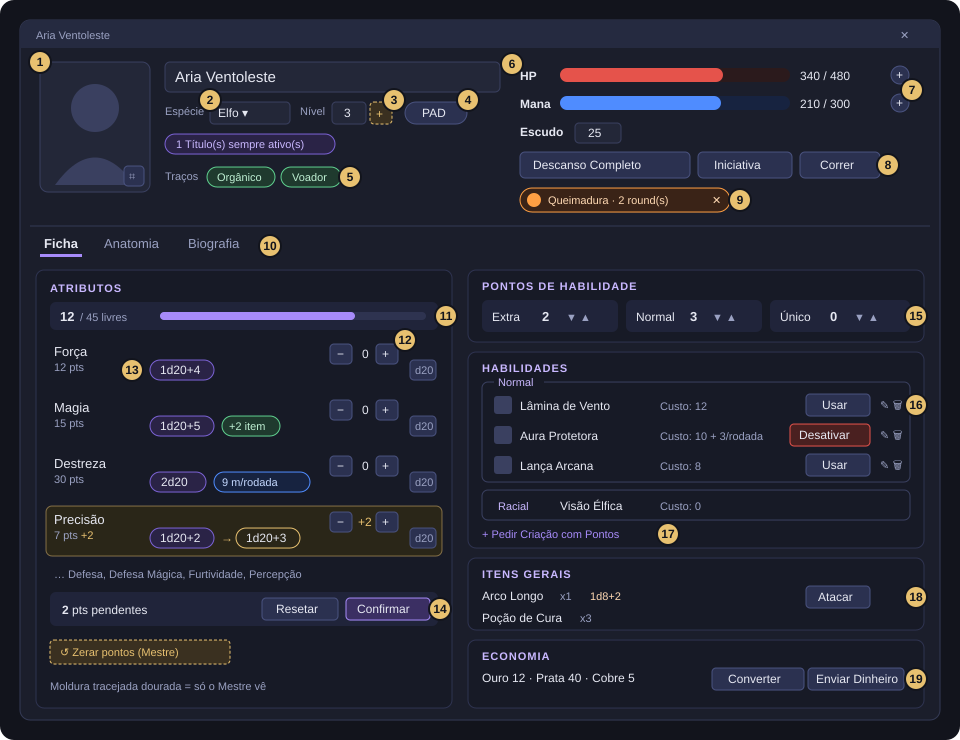

| # | O que é | Como funciona |
|---|---|---|
| 1 | **Retrato** | Clique para trocar a imagem. O botãozinho no canto ajusta o enquadramento (zoom e posição). |
| 2 | **Espécie** | Veja [Escolhendo a Espécie](#escolhendo-a-espécie). |
| 3 | **Nível** | Só leitura para você. Quem sobe o nível é o Mestre (o **+** dourado só aparece para ele). |
| 4 | **PAD** | Abre o celular do personagem. Só aparece se você carrega um Item marcado como PAD. Um número vermelho indica mensagens não lidas. |
| 5 | **Traços** | Etiquetas do personagem (Orgânico, Voador…). Vêm da Espécie; só o Mestre acrescenta ou retira. |
| 6 | **HP e Mana** | Barras com valor atual e máximo. Dá para digitar o valor atual direto no campo. |
| 7 | **+** ao lado da barra | Abre um campo rápido: digite um número e clique **− Dano**/**+ Cura** (HP) ou **− Gastar**/**+ Restaurar** (Mana). Nunca passa de 0 nem do máximo. |
| 8 | **Descanso Completo**, **Iniciativa**, **Correr** | Descanso volta HP e Mana ao máximo (use quando o Mestre disser que houve descanso). Iniciativa rola e entra no rastreador de combate. Correr só aparece se a mesa usa Deslocamento por rodada. |
| 9 | **Condições ativas** | Queimadura, Veneno, buffs… com rodadas ou ticks restantes. O **✕** remove (ex.: foi curado). A ampulheta aplica um tick manual. |
| 10 | **Abas** | **Ficha**, **Anatomia** (se a mesa usa) e **Biografia**. |
| 11 | **Pool de Pontos de Atributo** | Quantos pontos ainda estão livres. |
| 12 | **− / +** | Alocar pontos (ficam pendentes até confirmar). |
| 13 | **Fórmula de dados** e botão **d20** | O pool que o Atributo rola hoje. O botão rola no chat. |
| 14 | **Resetar / Confirmar** | Descarta ou grava os pontos pendentes. |
| 15 | **Pontos de Habilidade** | Extra, Normal e Único, com **▼** (quebrar) e **▲** (juntar). |
| 16 | **Habilidades** | Suas Skills agrupadas por tier, com **Usar** ou **Desativar**. ✎ abre a ficha da Skill. |
| 17 | **+ Pedir Criação com Pontos** | Pede uma Skill nova ao Mestre gastando 1 Ponto de Habilidade. |
| 18 | **Itens Gerais** | Inventário. Armas equipadas ganham o botão **Atacar**. |
| 19 | **Economia** | Moedas, peso total, **Converter** e **Enviar Dinheiro**. |

A linha do **Escudo** só aparece enquanto você tem Escudo acima de 0.

A aba **Biografia** tem três campos de **Personalidade** (Traços, Desejos, Estado Emocional) e o texto livre da biografia. A Personalidade serve de inspiração para o Mestre ao criar Skills Únicas e Ultimate para você — vale a pena preencher.

---

## 3. Atributos e rolagens

### Os oito Atributos

| Atributo | Para que serve no sistema |
|---|---|
| **Força** | Multiplica a sua **Vida máxima** (junto com Defesa). |
| **Defesa** | Multiplica a sua **Vida máxima** (junto com Força). |
| **Magia** | Multiplica a sua **Mana máxima** (junto com Defesa Mágica). |
| **Defesa Mágica** | Multiplica a sua **Mana máxima** e **reduz dano mágico** que você recebe: 2% por ponto, até 60%. |
| **Destreza** | Rola a **Iniciativa** (padrão), define o seu **Deslocamento** por rodada e é o teste de **reparo** de naves. |
| **Furtividade** | Esconder-se, passar despercebido. |
| **Percepção** | Notar coisas. É o contraponto da Furtividade — quando alguém tenta se esconder, o Mestre pede a rolagem. |
| **Precisão** | Pontaria e acerto, conforme o Mestre pedir. |

Qualquer Atributo pode ser rolado quando a cena pedir; quem decide o que a rolagem significa é o Mestre. O sistema não tem "Classe de Dificuldade" embutida — o Mestre julga o resultado.

> O Mestre pode dar outros nomes a esses Atributos (ex.: "Espírito" no lugar de "Magia") ou esconder alguns da ficha. As regras continuam as mesmas.

### Como um Atributo vira dados

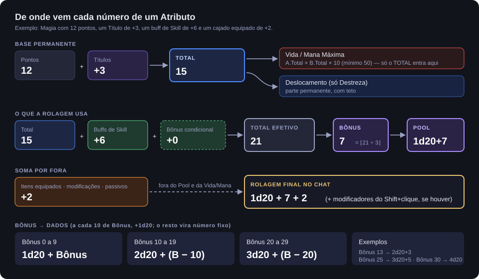

Cada Atributo tem três camadas, e é importante entender a diferença:

1. **Total** = seus pontos + bônus de Títulos. É a base **permanente**. Só ele entra na fórmula de Vida e Mana máximas.
2. **Total Efetivo** = Total + buffs e debuffs temporários de Skills + bônus condicionais contínuos. É o que vale para **rolar**.
3. **Bônus** = Total Efetivo ÷ 3, arredondado para baixo. Ele decide o **pool de d20**:
   - a cada 10 de Bônus você ganha **+1d20** (todos os dados são somados);
   - o que sobra (0 a 9) vira número fixo.

| Bônus | Rolagem |
|---|---|
| 0 a 9 | 1d20 + Bônus |
| 10 a 19 | 2d20 + (Bônus − 10) |
| 20 a 29 | 3d20 + (Bônus − 20) |
| 30 a 39 | 4d20 + (Bônus − 30) |

Exemplos: 12 pontos → Bônus 4 → **1d20+4**. 30 pontos → Bônus 10 → **2d20**. 75 pontos → Bônus 25 → **3d20+5**.

**Bônus de Item** (arma, armadura, modificação corporal, passivo de Skill) **nunca** entra nessa conta. Ele aparece como uma etiqueta verde **"+2 item"** ao lado da fórmula e é somado **por fora**, como número fixo, na hora da rolagem. Também não mexe na Vida nem na Mana.

### Alocando Pontos de Atributo

O pool é: **35 pontos no nível 1 + 5 por nível acima do 1** (padrão), mais pontos extras que o Mestre possa ter dado só para você.

1. Clique **+** no Atributo desejado. O ponto fica **pendente** (destacado em dourado) e a ficha mostra a fórmula nova ao lado da atual: `1d20+2 → 1d20+3`.
2. **−** desfaz um ponto pendente.
3. Quando estiver satisfeito, clique **Confirmar**. Só então os pontos passam a valer (rolagem, Vida, Mana).
4. **Resetar** descarta todos os pendentes e volta ao último estado confirmado.

O **+** trava quando não há mais pontos livres.

> **Pontos confirmados não voltam sozinhos.** Se você errou a distribuição, peça ao Mestre: ele tem o botão **Zerar pontos (Mestre)**, que devolve todos os pontos ao pool para você redistribuir do zero (nível, Títulos, Skills e Itens não mudam).

Se a sua mesa desligou o Pool de Pontos, os Atributos viram campos numéricos livres, sem orçamento nem confirmação.

### Rolando

Clique no botão **d20** da linha do Atributo. O resultado vai para o chat com a fórmula completa (bônus de item incluso).

Se você tiver marcado um alvo no mapa (tecla **T** sobre um Token), bônus condicionais do tipo "+2 na rolagem contra Mortos-vivos" são levados em conta automaticamente.

### Shift + clique: Vantagem e modificadores

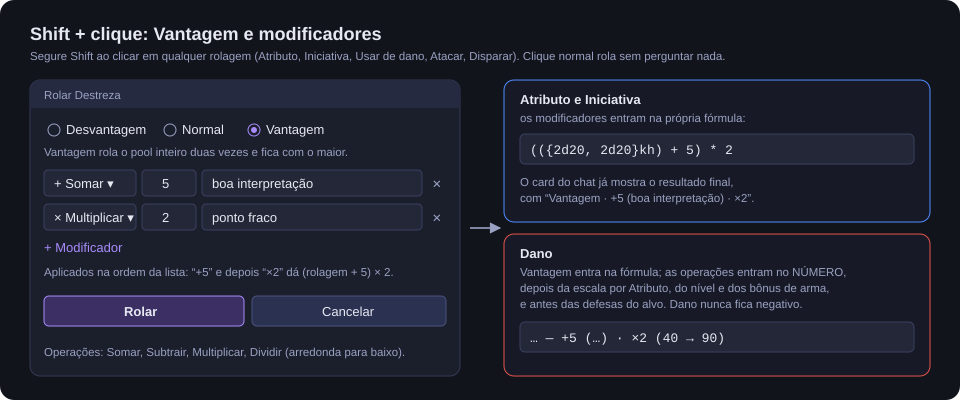

**Segure Shift ao clicar** em qualquer rolagem do sistema — Atributo, Iniciativa, **Usar** de uma Skill de dano, **Atacar** com arma, **Disparar** arma de nave. Abre uma janela com:

- **Desvantagem / Normal / Vantagem** — Vantagem rola o pool **inteiro** duas vezes e fica com o maior total; Desvantagem, com o menor.
- **Modificadores livres** — Somar, Subtrair, Multiplicar ou Dividir por um valor, com um motivo opcional ("boa interpretação", "ponto fraco"). Use **+ Modificador** para adicionar mais linhas.

As operações valem **na ordem da lista**: "+5" e depois "×2" dá (rolagem + 5) × 2. Divisão arredonda para baixo.

- Em Atributo e Iniciativa, tudo entra na fórmula e o chat mostra o resultado final.
- Em dano, a Vantagem entra na fórmula, e as operações são aplicadas ao número depois de todas as escalas automáticas e antes das defesas do alvo. Dano nunca fica negativo.

O sistema não tem regra de acerto crítico automática: se a cena pediu "dano dobrado", é você (ou o Mestre) quem escreve "×2" aqui.

---

## 4. Vida, Mana e Escudo

### Vida máxima e Mana máxima

Com os ajustes de fábrica:

- **Vida máxima** = Força.Total × Defesa.Total × 10 (nunca menos que 50);
- **Mana máxima** = Magia.Total × Defesa Mágica.Total × 10 (nunca menos que 50).

Depois disso somam-se, sem limite, os modificadores permanentes de Títulos, Skills, Itens equipados e modificações corporais ("+50 de HP Máximo"), e buffs temporários de Vida/Mana.

Exemplo: Força 8 e Defesa 6 → 8 × 6 × 10 = **480** de Vida.

Repare que só o **Total** (pontos + Títulos) entra aqui. Um buff de +10 de Força de uma Skill melhora a sua rolagem, mas **não** aumenta a sua Vida máxima.

> O Mestre pode trocar quais Atributos entram em cada fórmula, o multiplicador e o piso. Numa campanha sem magia ele pode até desligar a Mana: a barra some e as Skills passam a não custar nada.

O nome "Mana" também é configurável (Ki, Fluxo Quântico…). Este manual usa "Mana".

### Escudo pessoal

O **Escudo** é Vida extra temporária concedida por Skills (ex.: "Barreira Arcana dá 30 de Escudo"). Não tem máximo nem duração: fica até ser gasto.

Quando você leva dano, o **Escudo absorve primeiro** e só o que sobra sai da Vida. Exceção: **Dano Absoluto** ignora o Escudo. Alguns elementos (como Táquion, em campanhas sci-fi) causam **dano extra só no Escudo**.

Um Escudo pode acender uma **luz** no seu Token (um campo de energia brilhando). Ela é apagada sozinha quando o Escudo chega a 0 ou quando a Skill que o criou é desligada.

### Recuperando

- **Descanso Completo** (botão no cabeçalho): Vida e Mana voltam ao máximo.
- O campo **+** ao lado de cada barra: cura ou restaura um valor.
- Skills de cura e Condições como **Regeneração**.

---

## 5. Habilidades (Skills)

### Tiers

| Tier | De onde vem |
|---|---|
| **Extra** | Pedida com Ponto Extra, criada pelo Mestre, ou concedida por item. A mais simples. |
| **Normal** | Pedida com Ponto Normal (você ganha esses pontos por nível). |
| **Racial** | Vem da sua Espécie. Nunca é comprada. |
| **Único** | Pedida com Ponto Único, ou resultado de Fusão/Evolução feita pelo Mestre. |
| **Ultimate** | Só nasce de Fusão. Fica **escondida** da sua ficha até você possuir uma. |

### A lista de Habilidades na ficha

Cada Skill aparece com o nome, o **Custo** (e o Custo por Rodada, se for Ativa) e um botão:

| Botão | Significa |
|---|---|
| **Usar** (dado) | Skill de Dano. |
| **Usar** (brilho) | Efeito Temporário ou Descritiva. |
| **Usar** (quebra-cabeça) | A Skill tem Sub-Skills: você vai escolher qual usar. |
| **Desativar** | Habilidade Ativa que está ligada agora. Clicar desliga. |
| ⚙ no começo da linha | Skill **concedida** por um Item, Módulo ou modificação. É fixa. |

### O que acontece ao clicar em Usar

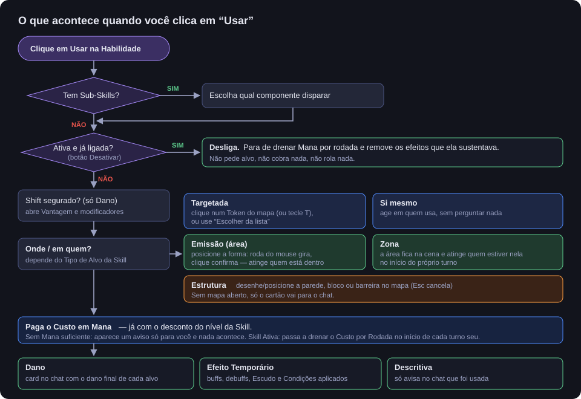

Em ordem:

1. **Sub-Skills?** Se a Skill for uma fusão (várias habilidades dentro de uma), você escolhe qual componente disparar.
2. **Ativa e já ligada?** Então o clique só desliga: para o dreno de Mana e remove os efeitos que ela sustentava. Não pede alvo nem cobra nada.
3. **Shift?** Numa Skill de Dano, o Shift abre Vantagem/modificadores.
4. **Onde ou em quem** — depende do **Tipo de Alvo** da Skill (veja abaixo).
5. **Custo** — a Mana é descontada. Se não houver Mana suficiente, aparece um aviso só para você e nada acontece.
6. **Resultado** — rolagem de dano no chat, efeitos aplicados, estrutura erguida, ou só um aviso de uso.

### Tipos de Alvo

| Tipo | Como escolher |
|---|---|
| **Targetada** | Um alvo. Se você já marcou um Token com **T**, ele é usado direto. Senão aparece uma faixa no topo: *"clique no alvo no mapa"* — clique num Token. **Escolher da lista** abre uma lista agrupada (**Na cena**, **Meus personagens**, **Personagens**), em que você mesmo aparece como "(você mesmo)". **Cancelar** desiste. |
| **Si mesmo** | Age em quem usa. Não pergunta nada. |
| **Emissão** | Uma forma (**Círculo**, **Cone** ou **Linha**) segue o mouse. A **roda do mouse gira** Cone e Linha. **Clique esquerdo** confirma, **clique direito** ou **Esc** cancela. Atinge na hora todos os Tokens dentro da forma. |
| **Zona** | Igual à Emissão para posicionar, mas a área **fica na cena** por algumas rodadas de combate. Quem estiver dentro dela **no início do próprio turno** sofre o efeito (dano rolado de novo a cada vez). Sair da área antes do seu turno escapa. Fora de combate a Zona não faz nada. |

Numa Emissão, o dano é rolado **uma vez** e cada alvo aplica as próprias defesas a esse mesmo total; o chat mostra uma linha por alvo.

Se a mesa não usa mapa (teatro da mente), a lista de alvos pode alcançar Atores sem Token — depende de uma regra que o Mestre liga.

### Mecânicas de uma Skill

A ficha da Skill (✎) tem as abas **Geral**, **Mecânica**, **Passivos**, **Sub-Skills** e **Descrição**. Na aba **Mecânica**, a **Mecânica ao Usar** é uma destas:

- **Descritiva** — usar não rola nem aplica nada, só avisa no chat. Pode ter passivos.
- **Dano** — rola a **Fórmula de Dano** (qualquer fórmula de dados do Foundry, ex.: `2d6+3`). Pode ter:
  - **Atributo de Escala** — multiplica o dano por (Atributo.Total)² ÷ 10. Com Magia 20: ×40. É o que faz o dano acompanhar o crescimento da Vida ao longo da campanha.
  - **Dano Mágico** — ativa a redução por Defesa Mágica do alvo.
  - **Dano Absoluto** — não pode ser resistido (veja [Combate](#dano-absoluto)).
  - **Elemento(s)** — Fogo, Gelo, Físico, Phaser… O dano é dividido entre eles.
- **Efeito Temporário** — uma lista de **Efeitos**, cada um com Alvo, Quantidade e Duração:
  - um Atributo (buff se positivo, debuff se negativo);
  - **HP** ou **Mana**, uma vez ou **Periódico** (a cada tick, ex.: Veneno −10 por rodada por 3 rodadas; Regeneração +5);
  - **Escudo** (soma direto, sem duração);
  - **Deslocamento (%)**;
  - aprimoramento das suas **armas equipadas** (mais dano, trocar o elemento, tornar o dano Mágico ou Absoluto);
  - sistemas de **Nave** (para Skills usadas por naves ou por tripulantes nelas).
  Cada Efeito pode ter uma **Condição** (Cegueira, Veneno…), que põe o ícone no Token.
- **Estrutura** — ergue uma parede, bloco ou barreira no mapa (veja [Estruturas](#estruturas)).

### Custo e Habilidades Ativas

- **Custo** é pago uma vez, ao usar.
- Uma **Habilidade Ativa** é um liga/desliga: o Custo é pago ao **ligar**, e o **Custo por Rodada** é drenado no **início de cada turno seu** em combate, enquanto ela estiver ligada. O botão muda para **Desativar**.
- Buffs de uma Skill Ativa duram **até você desligá-la**. Religá-la não "renova" nem acumula o que já está ativo.
- **Mana em 0 desliga todas as suas Habilidades Ativas de uma vez.** Os efeitos que elas sustentavam somem no início do seu próximo turno (ou na hora, fora de combate).

### Sub-Skills

Uma Skill fundida guarda dentro dela as Skills que a formaram, como componentes utilizáveis (no estilo das Skills Únicas de *Tensura*). Ao clicar em **Usar**, você escolhe qual componente disparar. Cada componente tem sua própria mecânica, custo e nível, e pode ficar ligado independentemente dos outros.

### Nível de uma Skill

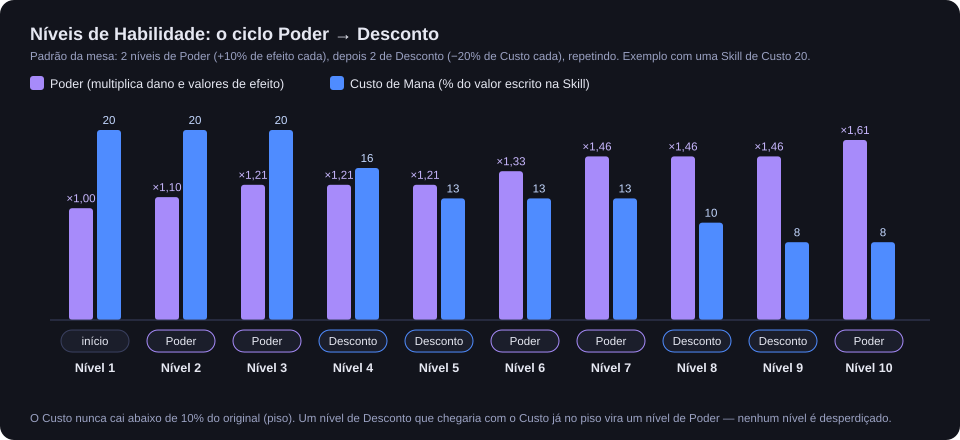

Cada nível segue um ciclo fixo e previsível (padrão): **2 níveis de Poder** (+10% no efeito cada) e depois **2 níveis de Desconto** (−20% no Custo cada), repetindo. Tudo é multiplicativo:

- Poder multiplica o dano e as quantidades dos Efeitos;
- o Custo nunca cai abaixo de 10% do original, e uma Skill que custa alguma coisa custa no mínimo 1;
- quando um nível de Desconto chegaria com o Custo já no piso, ele vira um nível de Poder — nenhum nível é desperdiçado.

O Custo escrito na Skill é sempre o do nível 1; o desconto é aplicado na hora de usar.

Uma Skill sobe de nível de dois jeitos:

- o Mestre clica **+ Nível** (normalmente quando o XP da Skill enche);
- você clica **Subir nível (1 Ponto)** na ficha da Skill, gastando 1 Ponto de Habilidade do mesmo tier dela (Extra, Normal ou Único). Não depende do XP.

Skills concedidas por item não sobem de nível.

### Skills de Resistência

Uma Skill pode ter, na aba **Passivos**, uma **Resistência**: **Geral** (reduz qualquer dano) ou a um **elemento** (reduz só aquele tipo — "Físico" cobre cortes e pancadas).

- 10% por nível.
- **Geral** para no nível 5 (50%). Não existe "Imunidade Geral".
- **Elemental** chega a 100% no nível 10 e passa a se chamar **"Imunidade: Fogo"**.
- Vale **enquanto a Skill estiver na ficha** — não precisa usar.
- Ganha **XP sozinha** quando de fato bloqueia dano, proporcional à fatia da sua Vida que ela salvou (bloquear 10% da sua Vida rende 10 XP; um arranhão rende 0).

Depois de muitos golpes do mesmo tipo (25, padrão), o sistema **avisa o Mestre** que você pode aprender a Resistência àquele tipo. É uma sugestão; quem concede é o Mestre.

### Outros passivos de uma Skill

Na aba **Passivos**:

- **Modificador permanente** de HP Máximo e Mana Máxima;
- **Bônus de atributo** — soma fixa na rolagem (como bônus de item), nunca na Vida/Mana;
- **Bônus condicionais** — regras "Quando → Então" (veja [Bônus condicionais](#bônus-condicionais)).

Na prática, Resistência, modificadores de HP/Mana e bônus de atributo valem **sempre que a Skill estiver na ficha**, mesmo numa Habilidade Ativa desligada. Só os **bônus condicionais** de uma Habilidade Ativa respeitam o liga/desliga (valem enquanto ela estiver ligada).

### Skills concedidas

Itens equipados, Módulos de nave e modificações corporais podem **conceder** uma Skill. Ela aparece com ⚙ na lista e:

- é fixa: não ganha XP, não sobe de nível, não entra em Fusão nem Evolução;
- some quando a fonte sai (desequipou, removeu a prótese, desligou o Módulo);
- qualquer mudança feita nela é perdida quando ela é concedida de novo — quem manda é a fonte.

---

## 6. Pontos de Habilidade

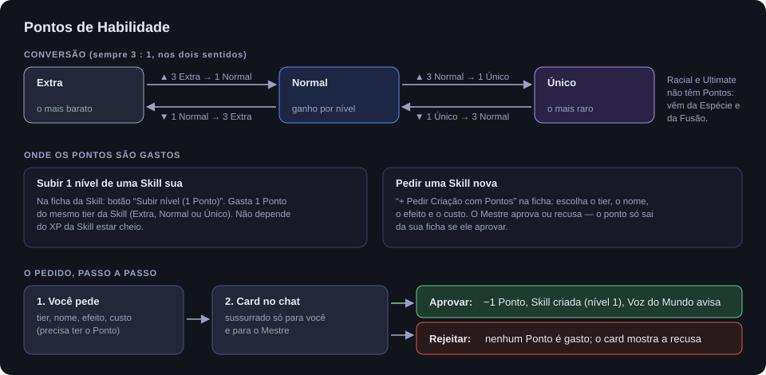

Existem três tipos: **Extra**, **Normal** e **Único**. Você começa com **3 Normais** e ganha **+2 Normais por nível** (padrão).

### Converter

- **▼** (quebrar): 1 ponto vira **3** do tier abaixo (1 Normal → 3 Extra; 1 Único → 3 Normal).
- **▲** (juntar): **3** pontos viram 1 do tier acima (3 Extra → 1 Normal; 3 Normal → 1 Único).

### Gastar

1. **Pedir uma Skill nova** — **+ Pedir Criação com Pontos**. Escolha o **Tier** (mostra quantos pontos você tem de cada), o **Nome**, o **Efeito** (descrição) e o **Custo** em Mana. Um card é enviado no chat, visível só para você e para o Mestre. O Mestre clica **Aprovar** (o ponto é descontado e a Skill aparece na sua ficha no nível 1, com aviso da Voz do Mundo) ou **Rejeitar** (nenhum ponto é gasto). Depois de aprovada, o Mestre normalmente ajusta a mecânica da Skill com você.
2. **Subir o nível de uma Skill** — veja [Nível de uma Skill](#nível-de-uma-skill).

Racial e Ultimate não têm Pontos: vêm da Espécie e de Fusões.

---

## 7. Combate

### Iniciativa

Clique **Iniciativa** no cabeçalho. Ela rola o seu pool de **Destreza** (padrão) — o mesmo `Nd20 + fixo` de qualquer rolagem de Atributo, com bônus de item — e lança o valor no rastreador de combate.

- É preciso haver um combate criado.
- Se o seu personagem ainda não está no combate, aparece um aviso para pedir ao Mestre que o adicione.
- Shift + clique funciona aqui também.

### Deslocamento por rodada

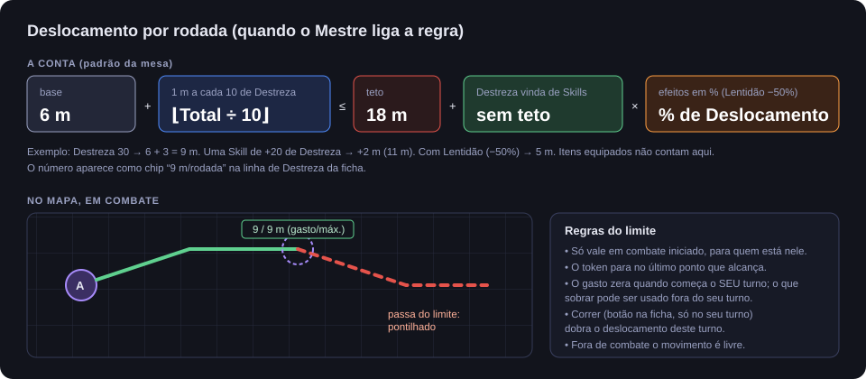

Se a mesa ligou esta regra, a linha da Destreza mostra um chip como **"9 m/rodada"** (passe o mouse para ver de onde vem cada parte).

- **Base 6 m + 1 m a cada 10 de Destreza**, com teto de **18 m** para a parte que vem dos seus pontos e Títulos (padrão).
- Destreza vinda de Skills soma **por cima do teto** (e diminui se for um debuff).
- Efeitos em %, como **Lentidão (−50%)**, valem sobre o total.
- Itens não contam.

No mapa, em combate:

- a régua do Token mostra **gasto / máximo**;
- o trecho que passa do limite fica **pontilhado** e o Token para no último ponto que alcança;
- o gasto zera quando começa **o seu turno**; o que sobrar pode ser usado fora dele;
- **Correr** (botão no cabeçalho, só no seu turno) **dobra** o deslocamento daquele turno;
- fora de combate, e para quem não está no combate, o movimento é livre.

### Atacando e sendo atacado

Os três jeitos de causar dano — **Usar** uma Skill de Dano, **Atacar** com uma arma equipada e **Disparar** uma arma de nave — seguem o mesmo caminho:

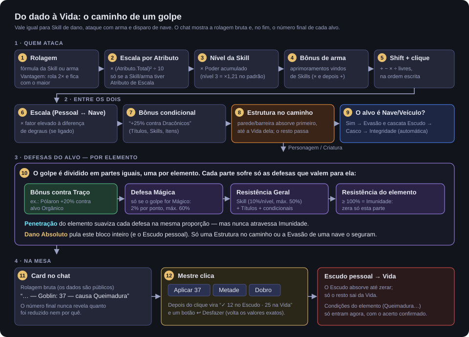

O que você vê no chat:

- a **rolagem bruta** (os dados são públicos);
- ao final, o **número final de cada alvo**: `— Goblin: 37`, e se algum elemento aplicou Condição, `— causa Queimadura`.

O chat **nunca mostra quanto foi reduzido nem por quê**. As defesas do alvo são segredo dele — você só vê o resultado.

O dano **não sai da Vida sozinho**: o Mestre clica **Aplicar** (ou **Metade**/**Dobro**) no card. O Escudo pessoal absorve primeiro, e as Condições do elemento só entram nesse clique. Se ele errar, há **Desfazer**, que volta os valores exatos.

### Defesas contra o seu dano

| Defesa | Quando vale |
|---|---|
| **Defesa Mágica** | Só contra dano marcado como **Mágico**. 2% por ponto de Defesa Mágica do alvo, até 60%. |
| **Resistência Geral** | Contra qualquer dano. Vem de Skills (até 50%) e Títulos. |
| **Resistência ao elemento** | Só contra a parte daquele elemento. 100% ou mais = **Imunidade**. |
| **Penetração** | É do atacante: alguns elementos ignoram parte das defesas acima. Nunca atravessa Imunidade. |

### Dano por elemento

Um golpe com vários elementos é **dividido em partes iguais**, e cada parte sofre só a Resistência do próprio elemento. Assim, ser imune a Fogo não anula a metade de Gelo de um golpe Fogo + Gelo:

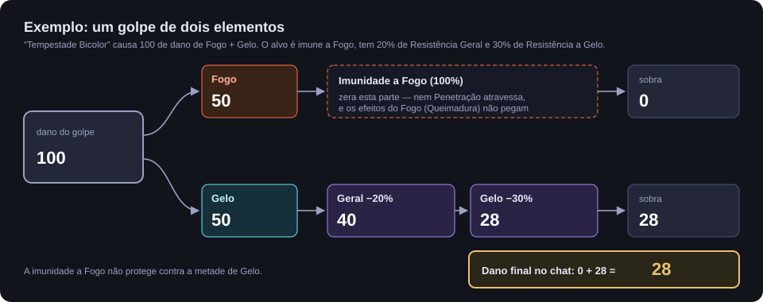

Elementos podem ter efeitos ao acertar, definidos pelo Mestre. Os de fábrica:

| Elemento | Efeito ao acertar |
|---|---|
| Fogo | 25% de chance de **Queimadura** |
| Gelo | 25% de chance de **Lentidão** |
| Plasma *(sci-fi)* | 25% de chance de **Queimadura** |
| Disruptor *(sci-fi)* | Penetração 10% |
| Transfásico *(sci-fi)* | Penetração 40% |
| Pólaron *(sci-fi)* | +20% de dano contra alvos **Orgânicos** |
| Táquion *(sci-fi)* | +30% de dano extra **só no Escudo** |

Quem é imune a um elemento também não sofre os efeitos dele.

### Dano Absoluto

**Não pode ser resistido**: ignora Defesa Mágica, Resistências, Imunidade e o Escudo pessoal. Mas **pode ser evitado**: uma Estrutura no caminho segura o golpe, e uma Nave ainda pode desviar pela Evasão.

### Escala

Se a mesa usa **Escala**, dano entre tamanhos diferentes é multiplicado ou dividido (fator 10 por degrau): **Pessoal → Veículo → Nave → Capital**. Uma pistola faz 1/100 do dano numa Nave; um canhão de Nave faz 100× numa pessoa. Uma arma pode ter a própria escala (uma bazuca anti-tanque pode ser "Veículo" mesmo na mão de uma pessoa).

### Condições

Condições são estados com nome e ícone no Token: **Cegueira, Veneno, Queimadura, Lentidão, Atordoamento, Silêncio, Paralisia, Medo, Sangramento, Regeneração** (padrão).

- Algumas têm efeito numérico automático: Queimadura e Veneno tiram Vida a cada rodada, proporcional ao dano do golpe que as causou; Lentidão corta 50% do Deslocamento; Regeneração cura 5% da Vida máxima por rodada.
- Outras (Cegueira, Atordoamento, Medo…) são **só o marcador**: o sistema **não impede nenhuma ação** sozinho. O Mestre decide, na mesa, o que "estar cego" significa na cena.
- Ticks por rodada acontecem sozinhos no **início do seu turno**. Ticks **manuais** (cura de longo prazo fora de combate) esperam um clique na ampulheta do chip na sua ficha.
- Dano por tick é reduzido pelas suas Resistências, mas **não** pela Defesa Mágica. Cura nunca é reduzida.
- **Reaplicar a mesma Condição renova, não acumula**: a duração passa a ser a maior entre a que restava e a nova, e o valor fica o mais forte.

### Bônus condicionais

Títulos, Skills e Itens podem ter regras **"Quando → Então"**, montadas em menus. Exemplos:

- *Quando o oponente tem o Traço Dracônico → +25% de dano causado* (o Título "Caçador de Dragões").
- *Quando minha Vida está abaixo de 30% → +5 no atributo Força* (contínuo: vale para as rolagens enquanto a condição for verdadeira, nunca para a Vida máxima).
- *Quando o dano é do elemento Fogo → +20% de Resistência a Fogo*.
- *… por Condição no oponente* multiplica o valor por quantas Condições o alvo tem.

| "Quando" | "Então" |
|---|---|
| Sempre · Oponente tem o Traço · Oponente é Nave/Veículo · Oponente tem a Condição · O dano é do elemento · Minha Vida abaixo de (%) · Eu tenho a Condição · Estou em combate | % de dano causado · na rolagem de (atributo) · % de Resistência a · no atributo (contínuo) |

"Oponente" é sempre o outro lado da ação: quando você ataca, é o alvo; quando você se defende, é quem atacou.

### Estruturas

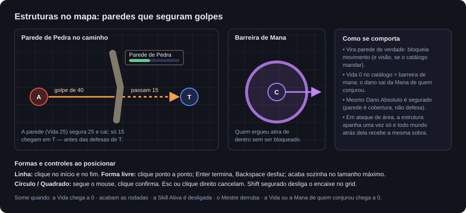

Skills de **Estrutura** erguem **Parede de Pedra**, **Bloco de Gelo**, **Barreira de Mana**… (catálogo do Mestre) como paredes de verdade no mapa:

- bloqueiam movimento (e visão, se o catálogo mandar);
- todo mundo vê a faixa colorida, o nome e a barra de Vida (os números só o Mestre vê);
- **bloqueiam ataques**: um golpe cuja linha atravessa a Estrutura bate nela primeiro, até a Vida dela, e só o resto chega no alvo — **inclusive Dano Absoluto**;
- quem ergueu a Estrutura atira de dentro dela sem ser bloqueado;
- **Barreira de Mana** (Vida 0 no catálogo): o dano que ela leva sai da **sua Mana**, e ela cai quando a sua Mana acaba.

Para posicionar:

| Forma | Como |
|---|---|
| **Linha reta** | clique no início e depois no fim |
| **Forma livre** | clique ponto a ponto; **Enter** termina, **Backspace** desfaz o último; acaba sozinha no tamanho máximo |
| **Círculo** / **Quadrado** | segue o mouse; clique confirma |

**Esc** ou clique direito cancelam. Segure **Shift** para posicionar sem encaixar no grid.

Uma Estrutura cai quando: a Vida dela chega a 0; acabam as rodadas de duração; você desliga a Skill (se for Ativa e sem prazo); o Mestre a derruba; ou a sua Vida ou Mana chega a 0.

---

## 8. Itens e armas

A ficha de um Item Geral tem as abas **Geral**, **Arma** e **Enquanto equipado** (além de **Descrição**).

- **Geral**: Quantidade, Peso, Valor (com a moeda) e o interruptor **Equipado**.
- **Arma**: liga **"Este item é uma arma"** e define **Fórmula de Dano**, **Atributo de Escala**, **Dano Mágico**, **Dano Absoluto**, **Escala do golpe** e **Elemento(s)** — os mesmos campos de uma Skill de Dano.
- **Enquanto equipado**: a **Habilidade Concedida**, **Modificador permanente** de HP/Mana, **Bônus de atributo** e **Bônus condicionais**.

**Tudo depende de Equipado.** Ligado: a Skill é concedida, os bônus valem e, se for arma, aparece **Atacar** na sua ficha. Desligado: a Skill some, os bônus param de contar, e a arma mostra "(desequipada)".

### Atacar com uma arma

Clique **Atacar** (Shift para modificadores), escolha o alvo como numa Skill Targetada, e o dano segue exatamente o mesmo caminho de uma Skill de Dano. Diferenças: arma não tem nível, não custa Mana e só ataca um alvo (arma de área é uma Skill).

Skills de **aprimoramento de arma** (Efeito Temporário com alvo "Dano das Armas equipadas", "Elemento das Armas", "Armas causam dano Mágico", "Armas causam Dano Absoluto") valem para **todas as armas equipadas** enquanto durarem.

Só o Mestre cria Itens na sua ficha (botão **+ Novo Item**). Você pode receber itens arrastados de compêndios ou de outras fichas.

---

## 9. Títulos

Títulos são conquistas narrativas ("Caçador de Dragões", "Herói de Ashcroft") concedidas pelo Mestre. Ficam no bloco **Títulos** da ficha e estão **sempre ativos** — não existe "título equipado". Um Título pode ter:

- **Bônus permanentes** em Atributos (entram no **Total**, portanto contam para Vida/Mana e rolagem) ou direto em HP/Mana máximos;
- **Resistência a dano** — um percentual fixo, Geral ou por elemento. Soma com a Resistência de Skill do mesmo tipo;
- **Bônus condicionais**.

Também mostram **Concedido por** e **Raridade**.

---

## 10. Anatomia: Partes do Corpo e próteses

A aba **Anatomia** lista suas **Partes do Corpo**, cada uma com Vida própria e um estado: **Intacto**, **Danificado** ou **Destruído**. Elas nascem do preset da sua Espécie.

O sistema não distribui dano nas partes sozinho: é uma ferramenta para a narrativa ("seu braço esquerdo foi atingido"). O Mestre, ou você com a autorização dele, ajusta a Vida e o estado da parte.

Na ficha de uma Parte do Corpo:

- **Detalhes**: Slot, Origem (Espécie), Vida atual/máxima e **Prótese** (Natural/Protética);
- **Modificações**: cada modificação ou prótese instalada pode ter descrição, uma **Habilidade Concedida** (o botão **Conceder Habilidade à ficha** / **Remover Habilidade da ficha** a liga e desliga), modificadores de HP/Mana máximos e bônus de atributo.

Modificações contam **enquanto estiverem instaladas**, sem precisar de "equipar". Você pode criar Partes novas com **+ Nova Parte do Corpo** (um membro regenerado, um implante).

---

## 11. Economia: moedas

O bloco **Economia** mostra cada moeda (padrão: Ouro, Prata e Cobre — 1 Ouro = 10 Prata = 100 Cobre), o peso de cada pilha e o **peso total em moedas**. O peso é só informativo: não há limite de carga.

Os valores só são editáveis pelo Mestre. Você usa dois botões:

- **Converter** — troca uma quantidade de uma moeda por outra. Se a conversão não der número inteiro, o **resto cai na moeda de valor menor**, e nada se perde.
- **Enviar Dinheiro** — transfere para outro Personagem **que esteja na cena atual**.

---

## 12. Experiência, níveis e a Voz do Mundo

- O **XP** do personagem e de cada Skill fica num bloco que **só o Mestre vê**. Ele concede XP e decide quando subir o nível.
- O XP para no teto do nível: não dá para "guardar" XP para o próximo nível. Quando a barra enche, a Voz do Mundo avisa.
- Curva padrão: **100 × nível** de XP para passar de nível (100 no nível 1, 1000 no nível 10).
- Skills de Resistência ganham XP sozinhas ao bloquear dano.

**Ao subir de nível** (padrão):

- +5 Pontos de Atributo no pool (distribua e confirme);
- +2 Pontos de Habilidade Normais (entram sozinhos).

### Voz do Mundo

É o canal de anúncios privados do sistema: aparece no chat **só para você e para o Mestre** (sussurro). Anuncia subidas de nível, XP cheio, Skills aprovadas, Fusões, Evoluções, Resistências ao alcance e pontos devolvidos.

---

## 13. Naves e Veículos (para quem tripula)

Esta seção só vale se a sua mesa usa Naves e Veículos.

### Tripulação

O Mestre coloca personagens na tripulação arrastando-os para a aba **Tripulação** da ficha da Nave. Cada tripulante tem um **posto** (Capitão, Piloto, Engenheiro, Tático, Ciências, Médico…), mas o posto só diz **quem está onde**: **qualquer tripulante opera a Nave inteira** — ajusta energia, dispara, usa as Skills da Nave — e troca o próprio posto no seletor da linha dele. Ao sair da tripulação, você perde esse acesso.

### A ficha da Nave

**Cabeçalho**: tipo (Nave Espacial ou Veículo), **Porte** e **Classe** (só o Mestre muda), Traços, e as barras:

- **Escudos** — valor atual/máximo, e a **Recarga** quando ele zerou;
- **Casco** — é a Vida dos Módulos de Blindagem;
- **Integridade Estrutural** — soma da Vida dos Módulos (menos Casco, Escudo e Armas);
- **Movimento** (casas por rodada) e **Evasão** (% de cada tiro que a nave evita), se a mesa usa Movimento e Evasão de naves. Sem essa regra, aparece **Manobra** (Nave) ou **Velocidade** (Veículo);
- **Combustível/Bateria** (só Veículo).

**Abas**: **Sistemas**, **Armas**, **Habilidades**, **Tripulação**, **Registro** (diário de bordo em texto livre).

### Energia

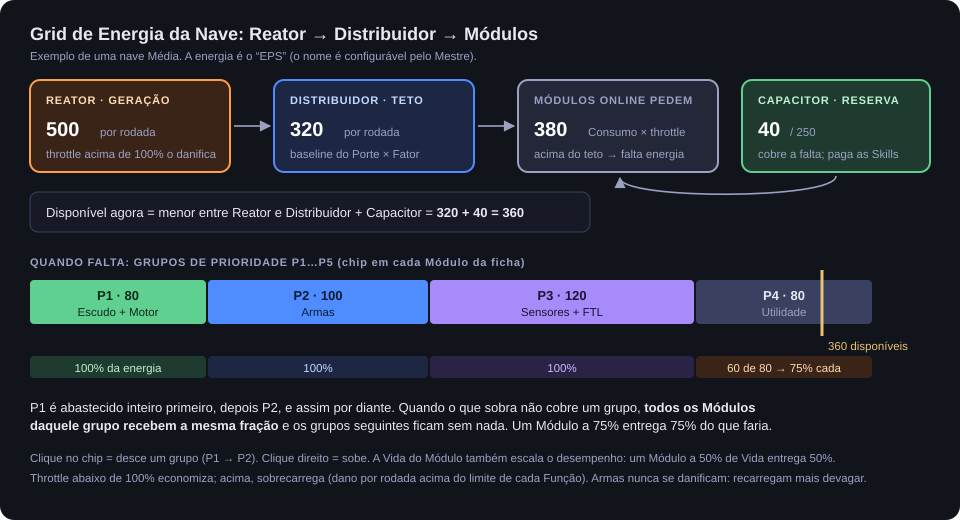

No topo de **Sistemas**:

- **Reator** gera energia por rodada;
- **Distribuidor** é o teto do que a nave consegue entregar por rodada;
- **Capacitor** é a reserva (vem da Bateria; sem Bateria, os conduítes do casco guardam um pouco). É dele que sai o Custo das Skills da Nave;
- **Demanda** compara o consumo dos Módulos ligados com o que a nave entrega, e avisa quando falta.

Em cada linha de Módulo você controla:

| Controle | O que faz |
|---|---|
| **P1…P5** | Grupo de prioridade. Clique desce um grupo; clique direito sobe. Quando falta energia, P1 é abastecido primeiro; um grupo que não cabe inteiro divide o que sobra **por igual**; os grupos seguintes ficam sem. |
| **Throttle** (⏬ − valor + ⏫) | Potência do Módulo, em %. Abaixo de 100% economiza energia e rende menos. Acima de 100% rende mais e **sobrecarrega**: o Módulo perde Vida a cada rodada (o Reator sofre com qualquer valor acima de 100%; outros Módulos toleram mais). |
| **Liga/Desliga** | Módulo desligado não consome nem funciona. Um Módulo com Vida 0 desliga sozinho e só volta a ligar com pelo menos **15%** da Vida. |

Um Módulo rende proporcionalmente à própria Vida (a 50% de Vida entrega 50%) e à energia que recebe (aparece "⚠ recebendo 60% da energia pedida").

### Armas

Na aba **Armas**, cada arma mostra Porte, Dano, Penetração e Throttle.

- **Disparar** rola o dano e escolhe o alvo como uma Skill Targetada (Shift para modificadores).
- Depois de disparar, a arma entra em **Recarga** (⏳ rodadas); o botão fica desabilitado até zerar. A contagem desce no início de cada turno da nave.
- **Throttle acima de 100% numa arma não a danifica**: aumenta Dano e Penetração **e** alonga a Recarga na mesma proporção.

### Dano na Nave

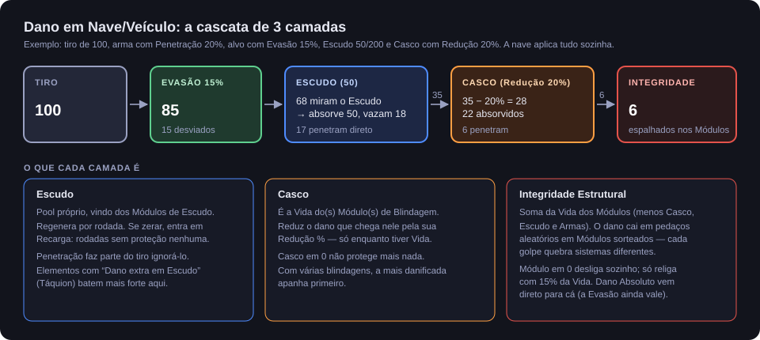

Diferente de personagens, a Nave **aplica o dano sozinha**, camada por camada: **Evasão → Escudo → Casco → Integridade Estrutural**. O dano que chega na Integridade cai em pedaços aleatórios em Módulos sorteados — cada golpe quebra sistemas diferentes. O card do chat mostra quanto foi para cada camada e quais Módulos foram atingidos.

### Habilidades da Nave

A aba **Habilidades** lista as Skills concedidas pelos Módulos ligados. Usam-se como as suas, mas o Custo sai do **Capacitor**, e o Custo por Rodada das Ativas é descontado da geração do Reator enquanto estiverem ligadas.

### Reparo em campo

Use a macro **Pedido de Reparo** (o Mestre a cria na barra de macros). Escolha a Nave, **o que** reparar (os Escudos ou qualquer Módulo — o Casco e a Integridade Estrutural se reparam consertando os Módulos deles) e **o engenheiro** (um personagem seu). O Mestre recebe o pedido, rola **Destreza** do engenheiro e, se julgar que deu certo, clica **Restaurar Vida** (2d6 de Vida, sem passar do máximo). Consertar algo grande leva mais tentativas.

---

## 14. PAD — o celular do personagem

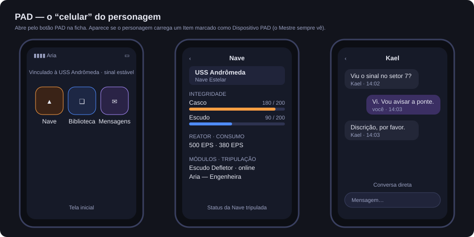

O PAD é um aplicativo em forma de celular, aberto pelo botão **PAD** da ficha. O botão aparece se o seu personagem carrega pelo menos um Item marcado pelo Mestre como **Dispositivo PAD** (não precisa estar equipado).

Três telas, que o Mestre pode ligar ou desligar uma a uma:

- **Nave** — status da Nave/Veículo que você tripula: Casco, Escudo, Reator, Consumo, Módulos e tripulação, com **Ver Ficha Completa da Nave**. Tripulando mais de uma, escolha no topo.
- **Biblioteca** — favoritos. **Arraste** um Item, Registro (nota) ou Ator para a tela para salvá-lo. A aba **Pessoal** é só sua; a aba **Da (nome da Nave)** é compartilhada com a tripulação. **✕** remove.
- **Mensagens** — conversas diretas e em grupo entre personagens:
  - **Contatos**: personagens de jogadores visíveis, seus colegas de tripulação e contatos que você salvou;
  - **Compartilhar Meu Contato**: envia seu contato para quem está na cena; quem recebe clica **+ Adicionar** em **Contatos Compartilhados**;
  - **+ Novo Grupo**: dê um nome, marque os membros e **Criar Grupo**;
  - mensagens novas mostram um número no ícone e no botão PAD da ficha.

> **Privacidade:** o Mestre recebe cópia de **todas** as conversas do PAD. Ele pode também falar como qualquer NPC. Mensagens do PAD não aparecem no chat normal do Foundry.

---

## 15. Perguntas frequentes

**Cliquei em Usar e não aconteceu nada.**
Provavelmente faltou Mana: o aviso aparece só para você no canto da tela. Confira também se você não cancelou a escolha de alvo ou o posicionamento da área.

**O botão Atacar não aparece na minha arma.**
A arma precisa estar **Equipada** (ficha do item, aba Geral) e ter **"Este item é uma arma"** ligado com uma Fórmula de Dano.

**A Iniciativa diz para pedir ao Mestre.**
Seu personagem ainda não está no combate. Só o Mestre adiciona combatentes.

**Meu Token parou no meio do caminho.**
Você gastou o deslocamento do turno. Ele volta no início do seu próximo turno. O botão **Correr** dobra o deslocamento, mas só no seu turno.

**O chat mostra 50 nos dados e 20 no final. Por quê?**
O alvo tem defesas (Resistência, Defesa Mágica, Escudo, uma Estrutura no caminho…). O sistema nunca revela quais.

**A Skill que o meu item dava sumiu.**
O item foi desequipado ou removido. Equipe de novo.

**Meu buff não aumentou a minha Vida.**
Buffs temporários de Atributo só mudam a rolagem. A Vida máxima usa só pontos e Títulos.

**Não vejo o botão PAD.**
Seu personagem precisa carregar um Item marcado como Dispositivo PAD, e a mesa precisa usar o PAD.

**Posso editar a mecânica das minhas Skills?**
A ficha é sua e os campos são editáveis, mas combine com o Mestre: ele é quem aprova o que cada Skill faz. O nível só o Mestre muda (ou você, gastando Ponto).

---

## 16. Glossário

| Termo | Significado |
|---|---|
| **Total** | Pontos + Títulos de um Atributo. Base de Vida/Mana. |
| **Total Efetivo** | Total + buffs temporários. Base da rolagem. |
| **Bônus** | Total Efetivo ÷ 3. Define quantos d20 você rola. |
| **Pool** | O conjunto de dados de uma rolagem (ex.: 2d20+3). |
| **Bônus de item** | Soma fixa por fora do pool, vinda de itens e passivos. |
| **Tier** | Nível de raridade de uma Skill: Extra, Normal, Racial, Único, Ultimate. |
| **Habilidade Ativa** | Skill liga/desliga, com Custo por Rodada. |
| **Sub-Skill** | Componente utilizável dentro de uma Skill fundida. |
| **Emissão / Zona** | Skills de área: instantânea / que fica na cena. |
| **Condição** | Estado com ícone (Veneno, Cegueira…), às vezes com efeito numérico. |
| **Tick** | Uma aplicação de um efeito periódico (dano ou cura por rodada). |
| **Resistência / Imunidade** | Redução percentual de dano; 100% num elemento = Imunidade. |
| **Penetração** | Parte das defesas que um ataque ignora. |
| **Dano Absoluto** | Dano que não pode ser resistido, só evitado. |
| **Escala** | Degrau de tamanho (Pessoal, Veículo, Nave, Capital). |
| **Traço** | Etiqueta de criatura (Orgânico, Dracônico, Voador…). |
| **Estrutura** | Parede/barreira que uma Skill ergue no mapa. |
| **Voz do Mundo** | Anúncio privado do sistema no chat. |
| **Porte** | Tamanho de Nave/Veículo (Mini → Capital) ou de Módulo (Compacto → Colossal). |
| **Throttle** | Potência de um Módulo de nave, em %. |
| **Capacitor** | Reserva de energia da Nave, que paga as Skills dela. |
| **PAD** | O celular do personagem. |
