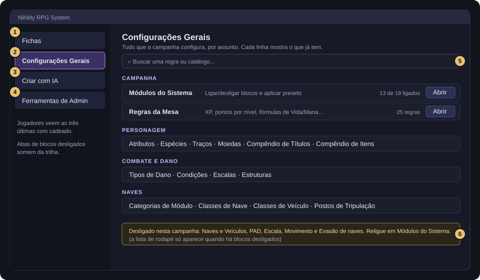
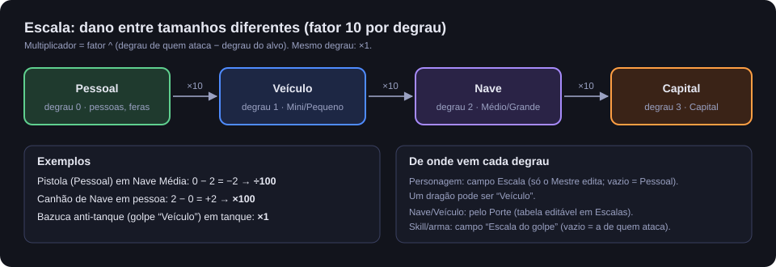
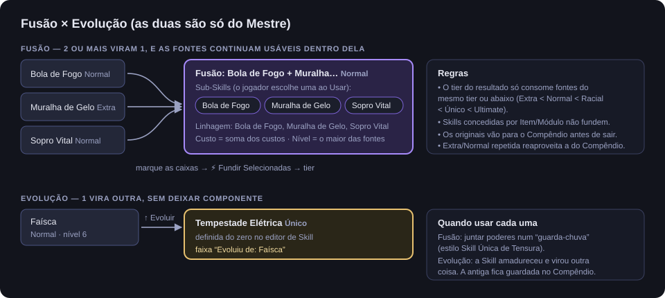
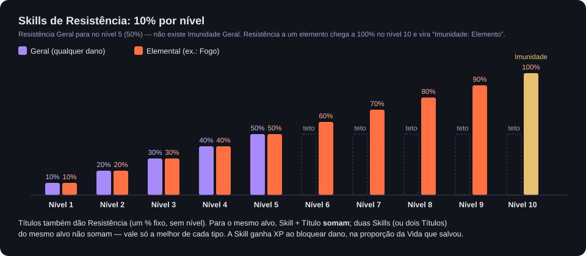

# Nihility RPG System — Manual do Mestre

Este manual é para quem conduz a mesa. Ele cobre como configurar o mundo, o que cada regra faz por baixo, as ferramentas que só o Mestre tem e como resolver as situações de jogo. O uso das fichas pelo lado do jogador (botões, rolagens, Skills, PAD) está no **[Manual do Jogador](manual-do-jogador.md)** — este manual não repete aquela explicação passo a passo, mas aprofunda as regras e acrescenta tudo o que é exclusivo do Mestre.

> **Filosofia do sistema, em uma frase:** o sistema **calcula os números**; o Mestre **julga a cena**. Não há Classe de Dificuldade embutida, Condições não bloqueiam ações sozinhas, e o dano em personagens só sai da Vida quando você clica. Sempre que o sistema pode automatizar uma conta chata, ele automatiza; sempre que a decisão é narrativa, ela fica com você.

---

## Sumário

**Parte I — Preparar o mundo**

1. [Instalação e primeiro mundo](#1-instalação-e-primeiro-mundo)
2. [O Menu Principal](#2-o-menu-principal)
3. [Módulos do Sistema e presets de campanha](#3-módulos-do-sistema-e-presets-de-campanha)
4. [Regras da Mesa](#4-regras-da-mesa)
5. [Catálogos](#5-catálogos)

**Parte II — Conduzir o jogo**

6. [Personagens, NPCs e criaturas](#6-personagens-npcs-e-criaturas)
7. [Progressão: XP, níveis e pontos](#7-progressão-xp-níveis-e-pontos)
8. [Habilidades: criar, aprovar, fundir, evoluir](#8-habilidades-criar-aprovar-fundir-evoluir)
9. [Combate](#9-combate)
10. [Itens, Títulos e Anatomia](#10-itens-títulos-e-anatomia)
11. [Naves e Veículos](#11-naves-e-veículos)
12. [PAD](#12-pad)

**Parte III — Ferramentas**

13. [Assistente de IA](#13-assistente-de-ia)
14. [Ferramentas de Admin](#14-ferramentas-de-admin)
15. [Solução de problemas e boas práticas](#15-solução-de-problemas-e-boas-práticas)
16. [Referência rápida de números](#16-referência-rápida-de-números)

---

# Parte I — Preparar o mundo

## 1. Instalação e primeiro mundo

**Requisito:** Foundry VTT **V13 ou mais novo** (verificado até a V14). A V12 não é suportada.

**Instalar pelo manifesto** — em *Game Systems → Install System*, cole:

```text
https://raw.githubusercontent.com/Lux-Theris/Sistema-Nihility---FoundryVTT/main/system.json
```

**Instalar à mão** — copie `system.json`, `module/`, `templates/`, `styles/` e `lang/` para `Data/systems/nihility-rpg-system/`.

### Checklist do primeiro mundo

1. Crie o mundo com o sistema **Nihility RPG System** e entre como Mestre. Na primeira carga o sistema cria sozinho os Compêndios do mundo (Habilidades, Partes do Corpo, Títulos, Itens, Módulos de Naves e os dois do PAD).
2. Abra o **Menu Principal** (botão **Nihility RPG System** no topo do Diretório de Atores).
3. **Configurações Gerais → Módulos do Sistema**: aplique o preset da sua campanha (**Fantasia Medieval**, **Sci-Fi Arcano** ou **Misto**) e ajuste o que quiser. O Foundry pede para recarregar.
4. **Regras da Mesa**: revise pontos iniciais, pontos por nível, curva de XP e fórmulas de Vida/Mana.
5. **Atributos**: renomeie ou esconda Atributos se a campanha pedir.
6. **Espécies**, **Moedas**, **Tipos de Dano**, **Condições**, **Estruturas**: revise os catálogos.
7. **Ferramentas de Admin → Macros do Sistema → Criar**: cria as macros do Menu e do Pedido de Reparo.
8. (Opcional) **Conteúdo de Exemplo → Criar**: enche o Compêndio com Skills Extra e Normais de referência.
9. (Opcional) Configure a IA na tela nativa de Configurações do Foundry (seção [13](#13-assistente-de-ia)).
10. Crie os personagens dos jogadores (Diretório de Atores → tipo **Personagem**) e dê a eles a propriedade da ficha.

---

## 2. O Menu Principal



Abre pelo botão **Nihility RPG System** no Diretório de Atores ou pela macro (`game.nihility.openAssistant()`). O botão aparece para todos, porque os jogadores usam a aba Fichas.

| # | Aba | Quem usa | Conteúdo |
|---|---|---|---|
| 1 | **Fichas** | Todos | Navegador de Atores com busca e filtros. O jogador só vê o que possui ou pode observar. |
| 2 | **Configurações Gerais** | Mestre | Lista pesquisável de tudo que a campanha configura, em seções. |
| 3 | **Criar com IA** | Mestre | Atalhos para o Assistente de IA, já na tarefa certa. Some se a IA estiver desligada. |
| 4 | **Ferramentas de Admin** | Mestre | Backup/desfazer, sincronização, macros, conteúdo de exemplo, exportar/importar. |
| 5 | Busca | Mestre | Filtra as linhas de Configurações Gerais pelo nome. |
| 6 | Rodapé | Mestre | Lista os blocos desligados nesta campanha. As linhas deles somem da lista. |

As abas de Mestre aparecem com cadeado para os jogadores. Cada linha de Configurações Gerais mostra o estado atual do catálogo ("14 tipos · 4 grupos", "3 moedas").

**Seções de Configurações Gerais:**

| Seção | Linhas |
|---|---|
| **Campanha** | Módulos do Sistema, Regras da Mesa |
| **Personagem** | Atributos, Espécies, Traços, Moedas, Compêndio de Títulos, Compêndio de Itens |
| **Combate e Dano** | Tipos de Dano, Condições, Escalas, Estruturas |
| **Naves** | Categorias de Módulo, Classes de Nave, Classes de Veículo, Postos de Tripulação |

---

## 3. Módulos do Sistema e presets de campanha

O mesmo sistema roda fantasia medieval, sci-fi e campanhas mistas. Cada bloco liga e desliga por mundo.

> **Regra de ouro: desligar um bloco nunca apaga nada.** O bloco some da interface e o sistema para de aceitar conteúdo novo daquele tipo. Atores, Itens e Compêndios que já existem continuam intactos e abríveis. Religar devolve o mundo exatamente como estava — inclusive trocando de preset no meio da campanha.

Mudar um interruptor pede recarga do mundo. Os campos numéricos dentro de um bloco (Deslocamento, Escala, Movimento de naves) valem sem recarregar.

### Os blocos

| Bloco | Padrão | Quando desligado |
|---|---|---|
| **Economia / Moedas** | ligado | Some o bloco de moedas da ficha. |
| **Títulos** | ligado | Some o bloco de Títulos e o chip do cabeçalho. |
| **Anatomia / Modificação Corporal** | ligado | Some a aba Anatomia; trocar de Espécie não cria mais Partes do Corpo (Skills Raciais continuam). |
| **Naves e Veículos** | ligado | Nenhuma Nave/Veículo **novo** pode ser criado; os existentes abrem e funcionam. Somem as tarefas de IA de nave. |
| **Fusão de Habilidades** | ligado | Somem as caixas de seleção e o botão ⚡ Fundir. Evolução continua. |
| **Pontos de Habilidade** | ligado | Some o bloco de Pontos, o pedido de criação, o "Subir nível (1 Ponto)" e o ganho por nível. |
| **Pool de Pontos de Atributo** | ligado | Os Atributos viram campos numéricos livres, sem orçamento nem confirmação. |
| **Resistências / Imunidades** | ligado | Some a seção de Resistência do editor de Skill e dos Títulos. Resistências já gravadas ficam guardadas. |
| **Condições de Status** | ligado | A paleta do HUD do token volta a ser a do Foundry; some o campo Condição dos Efeitos. |
| **Habilidades de Emissão (área)** | ligado | Somem Emissão e Zona do editor; Skills que já eram de área caem para alvo único. |
| **Assistente de IA** | ligado | Some a aba Criar com IA. |
| **PAD** (chave-mestra) | ligado | Nenhuma tela do PAD aparece, mesmo com as sub-opções ligadas. |
| ↳ **PAD — Conexão com a Nave** | ligado | Some a tela Nave do PAD e a aba Tripulação da ficha de Nave. |
| ↳ **PAD — Biblioteca** | ligado | Some a tela Biblioteca. |
| ↳ **PAD — Mensagens** | ligado | Some a tela Mensagens. |
| **Deslocamento por rodada** | **desligado** | Tokens andam livres em combate. Tem campos: **Base (m)** 6, **Passo de Destreza** 10, **Teto (m)** 18, **Mestre ignora o limite** (ligado). |
| **Estruturas** | ligado | Some a Mecânica "Estrutura" do editor de Skill. |
| **Escala (Personagem × Nave)** | **desligado** | Todo dano vale ×1 entre tamanhos. Campo: **Fator por degrau** 10. |
| **Movimento e Evasão de naves** | **desligado** | Naves andam livres e não têm Evasão; a ficha mostra Manobra/Velocidade. Campo: o teto de Evasão; as casas e a Evasão de cada Porte ficam nos catálogos de Portes (ver [11](#movimento-e-evasão)). |

Deslocamento, Escala e Movimento de naves vêm desligados porque mudam o comportamento dos tokens em combate: um mundo que só atualizou o sistema não deve ganhar uma regra nova sem você decidir.

### Presets de campanha

No topo de Módulos do Sistema há três botões. Um preset liga/desliga blocos de uma vez e **substitui** alguns catálogos pelo conteúdo pronto dele:

| Bloco | Fantasia Medieval | Sci-Fi Arcano | Misto |
|---|:---:|:---:|:---:|
| Economia, Anatomia, Pontos de Habilidade, Pool de Atributos, Resistências, Condições, Emissão, IA, Deslocamento, Estruturas | ✔ | ✔ | ✔ |
| Títulos, Fusão de Habilidades | ✔ | — | ✔ |
| Naves e Veículos, PAD, Movimento e Evasão de naves, Escala | — | ✔ | ✔ |
| **Catálogo de Tipos de Dano** | fantasia | energia (Star Trek) + fantasia | fantasia + energia |
| **Catálogo de Categorias de Módulo** | (não mexe) | estilo Star Trek | estilo Star Trek |

> Aplicar Sci-Fi ou Misto **troca** a lista de Tipos de Dano e de Categorias de Módulo do mundo. Se você personalizou essas listas, use **Exportar Configurações** antes.

---

## 4. Regras da Mesa

**Configurações Gerais → Regras da Mesa** reúne todas as regras numéricas do mundo, agrupadas por assunto. Toda regra nova que o sistema ganhar aparece aqui sozinha. Quase todas pedem recarga.

### Progressão

| Regra | Padrão | O que faz |
|---|---|---|
| Fórmula de XP por Nível | `100 * @nivel` | XP para sair do nível atual. Aceita só aritmética; fórmula inválida volta ao padrão. |
| Pontos de Atributo — Criação (Nível 1) | 35 | Pool inicial. |
| Pontos de Atributo — Por Nível | 5 | Somados ao pool a cada nível acima do 1. |
| Pontos de Habilidade Normais — Criação | 3 | Dados a cada personagem novo (não em cópias/importações). |
| Pontos de Habilidade Normais — Por Nível | 2 | Somados sozinhos quando o nível sobe. |
| Nível de Skill — Poder por nível (%) | 10 | Quanto cada nível de Poder multiplica o efeito. |
| Nível de Skill — Desconto de Custo por nível (%) | 20 | Quanto cada nível de Desconto corta do Custo. |
| Nível de Skill — Níveis de Poder no ciclo | 2 | |
| Nível de Skill — Níveis de Desconto no ciclo | 2 | |
| Nível de Skill — Piso do Custo (%) | 10 | O Custo nunca cai abaixo disso. |
| XP de Resistência — Fator | 100 | XP = (dano bloqueado ÷ Vida máxima) × fator. |
| Resistência — Golpes para aprender | 25 | Golpes de um tipo até sugerir a Resistência. 0 desliga. |

### Vida e Energia

| Regra | Padrão | O que faz |
|---|---|---|
| Fórmula de HP — 1º / 2º Atributo | Força / Defesa | HP Máx = A.Total × B.Total × Multiplicador. |
| Fórmula de Mana — 1º / 2º Atributo | Magia / Defesa Mágica | Mesma forma. |
| Fórmula de HP/Mana — Multiplicador | 10 | Mais baixo = campanha mais letal. |
| Fórmula de HP/Mana — Piso | 50 | Mínimo da fórmula (modificadores somam por cima). |
| Usar pool de Mana/Energia | ligado | Desligado: a barra some, Mana máx vira 0, nenhuma Skill de personagem cobra Custo. Naves não são afetadas. |
| Rótulo de Energia — Personagens | Mana | Ex.: Ki, Fluxo Quântico. |
| Rótulo de Energia — Naves | Sistema Eletro-Plasmático (EPS) | Nome longo, usado em títulos e chat. |
| Sigla da Energia de Naves | EPS | Forma curta, usada nas tabelas da ficha de Nave. |
| Custo variável — Expoente | 0,75 | Numa Skill que aceita variar a energia, investir r× o Custo dá força r^expoente (abaixo do Custo, proporcional). Menor = cada ponto extra vale menos. Sem teto. |
| Custo variável — Mínimo (% do Custo) | 25 | O menos que se pode investir. |

### Combate

| Regra | Padrão | O que faz |
|---|---|---|
| Atributo de Iniciativa | Destreza | Qual pool rola a iniciativa. |
| Escala de Dano por Atributo — Divisor | 10 | Dano × (Atributo.Total)² ÷ divisor. Menor = combate mais rápido. |
| Permitir alvo sem Token na cena | desligado | Ligado, a escolha de alvo busca no Diretório inteiro (para mesa sem mapa). |

### Configurações por navegador (tela nativa do Foundry)

Ficam só no seu navegador, nunca sincronizam com jogadores e nunca entram no Exportar:

| Setting | Uso |
|---|---|
| Provedor de IA | OpenAI-compatível ou Anthropic (Claude) |
| Endpoint de IA | URL de Chat Completions (só OpenAI-compatível) |
| Modelo de IA | Nome do modelo |
| Chave de API de IA | Chave do provedor |
| Modo Debug | Loga cada render/ação no console. Deixe desligado no dia a dia. |

---

## 5. Catálogos

Todos os catálogos são editados em janelas visuais, sem JSON à mão. Cada entrada tem um **id** (chave interna, sem espaços) e um **nome** exibido. **Evite mudar o id de algo já usado**: fichas antigas guardam o id.

### Atributos

Renomeie os oito Atributos (Força, Defesa, Magia, Defesa Mágica, Destreza, Furtividade, Percepção, Precisão) ou esconda-os da ficha.

- **As chaves não mudam**, só o rótulo. Efeitos, Títulos e fórmulas já gravados continuam apontando para o lugar certo.
- **Esconder é só visual**: um Atributo escondido ainda conta na fórmula de Vida/Mana. A janela avisa quando você esconde um Atributo usado na fórmula.
- **Restaurar padrões** volta os nomes de fábrica.

### Espécies, Linhagens, Heranças e Evolução

**Configurações Gerais › Personagem › Espécies** abre o editor: lista com busca à esquerda e, à direita, seis abas.

- **Geral** — grupo, se o jogador pode escolher na criação, descrição curta, **Traços** e **elemento do corpo**, Escala padrão, Deslocamento (base e ±%), slots e carga. Tudo aqui vale **ao vivo** para quem é desta Espécie.
- **Corpo** — Partes (chave, nome, **slot**, Vida, **Funções**). São **copiadas** para a ficha.
- **Skills Raciais** — editadas no editor completo de Skill; "Nv" vazio = desde o início (o normal), preenchido = só chega a partir daquele nível.
- **Passivos** — bônus de atributo (entram no Total, como um Título, e portanto na Vida/Mana), Vida/Mana máximas, Resistências (contam como Título: fica a melhor) e regras "Quando → Então".
- **Linhagens** — variações escolhidas na criação: somam Traços, elemento e Skills e podem **substituir** Skills Raciais da Espécie (a substituta herda o nível).
- **Evolução** — para onde a Espécie evolui, com nível mínimo (só aviso), dica para você, manter Linhagem e "Resistências viram Imunidade".

A **chave** de uma Espécie, de uma parte ou de uma Linhagem trava depois de salva (as fichas apontam para ela); para "renomear a estrutura", use **Duplicar como nova**. **Trazer do padrão…** acrescenta o conteúdo de fábrica que o seu catálogo ainda não tem (Espécies novas, Linhagens, Evolução) sem tocar no que você editou.

Salvar sobe a **versão** da Espécie quando partes ou Skills mudam. As fichas daquela Espécie mostram **"Espécie mudou"** e você sincroniza pelo botão **Sincronizar fichas…** (todas, com uma caixa por ficha) ou pela aba Origem (uma). Sincronizar só acrescenta e ajusta; remover o que saiu da Espécie é uma escolha explícita.

**Heranças** (Configurações Gerais › Personagem › Heranças) usam o mesmo editor, com as abas Geral · Corpo e Skills · Passivos · Regras. Uma Herança pode **tirar Traços** (Vampirizado deixa de ser Orgânico), trocar as partes de um **slot** (Convertido em Ciborgue troca os braços por próteses — os implantes vão junto), ter um texto de anúncio (`{nome}` vira o nome do personagem) e regras de convivência: Espécies permitidas e Heranças incompatíveis. Fora das regras, a prévia **avisa** e você aplica mesmo assim, se quiser.

**Na ficha (aba Origem)**, só você: **Trocar…** a Espécie ou a Linhagem, **+ Herança…** / **Retirar…**, **Evoluir…** (bloco "Evolução de Espécie" em Módulos do Sistema) e **Destravar escolha do jogador**. Toda mudança passa por uma **prévia**: perdas em vermelho no topo, próteses e implantes levados para a parte equivalente (ou que ficam como parte avulsa), Skills Raciais que saem guardadas no histórico com nível e XP (voltam se a origem voltar). Evoluir **mantém** as Skills Raciais antigas; a de mesma chave recebe a mecânica nova com o nível que tinha.

### Traços

Etiquetas de criatura: Orgânico, Mecânico, Dracônico, Voador, Sem Asas, Morto-vivo, Besta (padrão). Usados por elementos ("+20% contra Orgânico") e por bônus condicionais ("Caçador de Dragões").

A ficha soma os Traços da Espécie com os acrescentados à mão e tira os retirados à mão. Só o Mestre mexe: **+ Traço** abre uma lista com filtro; **✕** retira; um Traço retirado da Espécie aparece riscado com **↺** para restaurar.

### Moedas

Cada moeda: id, nome, ícone, **peso** por unidade e **valor base** (quantas unidades-base ela vale). A conversão entre quaisquer duas moedas usa a razão dos valores base, então hierarquias arbitrárias funcionam. Padrão: Ouro 100, Prata 10, Cobre 1.

### Tipos de Dano (elementos)

Cada elemento: id, nome, **cor**, **grupo** (Físico, Fantasia, Energia, Exótico… — organiza a janela de escolha), **Subtipo de** e **Efeitos ao acertar**:

**Subtipo de (hierarquia).** O Físico de fábrica tem três subtipos: **Cortante** (Decepar 10% + Sangramento 25%), **Perfurante** (Penetração 20%) e **Contundente** (+20% contra Mecânico, Atordoamento 10%). Um subtipo:
- passa pela Resistência **dele e de cada ancestral**, uma depois da outra (Geral → Físico → Cortante): Resistência Física 30% e Resistência a Cortante 20% deixam passar 56%. Imunidade em qualquer nível imuniza. As Skills de Resistência Física que já existem continuam valendo contra os três;
- herda os **efeitos ao acertar** do pai que não tiver (o mesmo efeito não rola duas vezes) e a linha do pai na **tabela de vantagens** (a dele manda); contra um subtipo vale o que se escreveu contra o pai, se nada foi escrito contra ele.

Armas e Skills marcadas "Físico" continuam o golpe genérico — escolha Cortante para ter Decepar. Catálogos salvos antes ganham os três subtipos sozinhos (uma vez, sem mexer no resto). Serve para qualquer elemento: Fogo › Fogo Infernal, Energia › Plasma…

**Tabela de vantagens entre elementos** (botão **Tabela de vantagens** no topo do editor; o mesmo botão volta aos cartões): linha = elemento que **ataca**, coluna = elemento que **defende**. Cada célula tem um de cinco níveis, estilo Pokémon — **Imune** ×0, **Ineficaz** ×0,5, **Neutro** ×1, **Efetivo** ×1,5, **Super efetivo** ×2 (multiplicadores em Regras da Mesa › Combate). **Clique esquerdo sobe um nível, direito desce.** A tabela é montada dos elementos na tela, então um elemento novo aparece nela na hora; cada cartão mostra o resumo ("Efetivo contra: Gelo · Ineficaz contra: Fogo"). O antigo efeito "Dano extra contra elemento" é convertido sozinho em nível (≥ +75% Super efetivo, acima de 0 Efetivo, abaixo de 0 Ineficaz, −100% Imune). Padrão: Fogo efetivo contra Gelo, Gelo ineficaz contra Fogo, Sombrio e Sagrado efetivos um contra o outro.

A vantagem vale contra quem **É** de um elemento:
- **Personagem/Criatura**: elemento da **Espécie** (editor de Espécies), de uma **Condição** com elemento (Encharcado = Água) ou de uma Skill com o Efeito **Elemento do corpo** (grupo "Elemento": escolha o elemento; dura as rodadas do Efeito, ou enquanto a Habilidade Ativa estiver ligada). Transformar-se muda só como a pessoa **recebe** dano; atacar com o elemento continua sendo da Skill/arma. Cada parte do golpe (uma por elemento) é multiplicada contra o corpo; corpo com dois elementos multiplica os dois (Fogo contra Planta + Gelo = ×3 com os padrões).
- **Escudo pessoal**: um Efeito de Escudo pode ter **Elemento do escudo** (Escudo de Água). No **Aplicar**, cada pool sofre o golpe com a vantagem contra o elemento DELE (sem a do corpo), e o que vaza para a Vida volta a ter a do corpo. Um corpo imune ainda gasta um Escudo de outro elemento.
- **Nave**: o Módulo de Escudo tem **Elemento do escudo** (a camada de Escudo usa a vantagem contra os elementos dos Escudos ligados); Casco e Integridade usam o elemento do corpo da Nave (Condição ou Skill).
- **Estrutura**: os Elementos do catálogo (Parede de Gelo = Gelo).
- **Dano Absoluto** ignora a tabela.

| Tipo de efeito | Campos | Comportamento |
|---|---|---|
| **Aplicar Condição** | Condição, Chance % | Rola a chance por acerto. A Condição usa o **efeito padrão** dela, calculado com o dano daquela parte do golpe. Só entra quando o dano é aplicado. |
| **Dano extra contra Traço** | Traço, % | +X% nesta parte se o alvo tiver o Traço. |
| **Dano por camada** | Camada (Escudo, Casco, Integridade), % | Multiplica a parte do golpe que chega naquela camada. **Pode ser negativo** (fraqueza): Phaser +20% no Escudo e −20% no Casco; Torpedo −50% no Escudo e +30% no Casco. O de Escudo vale também para o Escudo pessoal. |
| **Dano extra em Escudo** | % | O antigo; funciona como Escudo +X%. |
| **Decepar** | Chance % | Ferimentos por parte: se o golpe levar a parte atingida a 0, ela vira **Perdida**. |
| **Impede regeneração** | Chance %, Rodadas, Condição | Aplica uma Condição marcada "Impede regeneração" (padrão: Regeneração bloqueada). **0 rodadas = até ser removida.** |
| **Penetração** | % | Suaviza cada defesa proporcionalmente (Penetração 30% transforma 50% de Resistência em 35%). **Nunca atravessa Imunidade.** |
| **Nave: derrubar Módulo** | Chance %, Rodadas | Desliga um Módulo do alvo (o mirado, se houver; senão um ao acaso) por N rodadas da Nave atingida. |
| **Nave: drenar energia** | Chance %, %, Rodadas | Tira X% da Bateria na hora e o Reator gera X% a menos por N rodadas. |
| **Nave: baixar resistência** | Chance %, %, Rodadas | −X pontos de Resistência à Penetração (Escudo e Casco) e de Redução do Casco por N rodadas. |

Os três efeitos de Nave (e as Condições, contra Nave) **só disparam com a parte do golpe que passou do Escudo** — Escudo de pé é a primeira defesa. A chance ainda cai pelo **Endurecimento** do Módulo afetado + o da Classe (20% contra 30% de Endurecimento = 14%). Efeitos iguais não somam: renovam pro mais longo e mais forte.

Quem é imune ao elemento não sofre os efeitos dele. Um golpe é **dividido em partes iguais** entre os seus elementos (ver [9](#dano-por-elemento)).

Catálogo de fábrica (fantasia): Físico, Fogo (25% Queimadura), Gelo (25% Lentidão), Elétrico, Ácido, Sombrio, Sagrado. Catálogo de energia (preset Sci-Fi): Cinético (Escudo −50%, Casco +30%, Integridade +10%), Phaser (Escudo +20%, Casco −20%, 10% de derrubar Módulo por 2 rodadas), Disruptor (Pen. 10%, 20% de baixar resistência em 10 por 2 rodadas), Plasma (25% Queimadura, Casco +15%), Pólaron (+20% contra Orgânico, 20% de drenar 15% da energia por 2 rodadas), Táquion (Escudo +30%), Antiprótons (Integridade +15%), Transfásico (Pen. 40%). O preset só vale pra catálogos novos ou reaplicados; um catálogo já salvo não muda sozinho.

### Condições

Cada Condição: id, nome, ícone e um **efeito padrão** opcional.

Cada Condição pode ter **Elemento** (quem a carrega passa a ser daquele elemento, para a tabela de vantagens) e **Antimagia (nível)**: quem a carrega paga energia extra em toda magia (ver [Antimagia](#antimagia)). O catálogo padrão traz o **Selo Antimagia** (nível 1).

| Tipo de efeito | Campos |
|---|---|
| **Tick** (dano ou cura por rodada) | Alvo (Vida ou Mana), dano/cura, **Forma** do valor, Valor, Duração (rodadas), Tick (por rodada de combate ou manual) |
| **Modificador** | Atributo (fixo ou %) ou **Deslocamento** (sempre %), Valor (negativo reduz), Duração |

Formas do valor de um Tick:

- **Fixo** — o número escrito;
- **% do dano do golpe** — proporcional ao dano do golpe que aplicou (padrão da Queimadura e do Veneno). Assim um golpe de 5000 queima proporcionalmente, não 5 por turno. Sem golpe de onde tirar (marcação à mão sem valor, Skill que não causa dano), a Condição vira só o ícone;
- **% do máximo** — da Vida (ou Mana) máxima do alvo.

O efeito padrão é usado sempre que a Condição chega **sem valor próprio**: pelo efeito ao acertar de um elemento, por um Efeito de Skill com a Condição e Quantidade 0, ou quando você a marca no token e mantém "usar o efeito padrão".

| Condição de fábrica | Efeito padrão |
|---|---|
| Veneno | −5% do dano do golpe por rodada, 3 rodadas |
| Queimadura | −10% do dano do golpe por rodada, 2 rodadas |
| Sangramento | −5% do dano do golpe por rodada, 3 rodadas |
| Regeneração | +5% da Vida máxima por rodada, 3 rodadas |
| Lentidão | −50% de Deslocamento, 2 rodadas |
| Cegueira, Atordoamento, Silêncio, Paralisia, Medo | só o ícone |

Salvar o catálogo atualiza a paleta do HUD do token na hora.

### Escalas



A lista de Escalas (padrão Pessoal, Veículo, Nave, Capital) **é a ordem dos degraus**. Abaixo dela, duas tabelas dizem a Escala de cada **Porte de Nave** e de cada **Porte de Veículo**. Personagens usam a primeira Escala, a menos que você escolha outra na ficha (campo **Escala**, ao lado dos Traços — um dragão pode ser "Veículo"). O fator por degrau fica no bloco Escala de Módulos do Sistema.

### Estruturas

Cada Estrutura: id, nome, **cor**, **imagem** (opcional, textura para círculo/quadrado), **Forma** (Linha reta, Forma livre, Círculo, Quadrado), **Tamanho (m)** (comprimento máximo para linha/livre; raio para círculo; lado para quadrado), **Bloqueia movimento**, **Bloqueia visão**, **Vida** e **Duração (rodadas)**, mais **Luz**, **Segura golpes** (desmarcado: não para ataques — Muralha de Fogo, Campo Antimagia), **Mágica** (sofre antimagia), **Antimagia (nível)** (0 = não é campo), **Dano ao contato** (fórmula rolada contra quem atravessa ou termina o movimento dentro) e **Elementos** (a Estrutura é daquele elemento: golpes contra ela seguem a tabela de vantagens, e o dano ao contato é desses elementos).

- **Vida 0 = barreira de mana**: o dano que ela leva sai da Mana de quem conjurou.
- **Duração 0 = sem prazo**: fica até a Skill Ativa ser desligada, até você derrubar, ou até a Vida ou Mana de quem conjurou chegar a 0.
- **Luz** (**Configurar luz…**): cria luzes reais junto com as paredes (uma no centro de uma forma fechada, várias ao longo de uma linha), com as animações do Foundry (Campo de Energia, Domo Hexagonal, Grade de Força…). A janela tem **pré-visualização ao vivo no mapa**, só na sua tela, e nada é salvo até **Aplicar**. As luzes são **apagadas** junto com a Estrutura.

Padrão: Parede de Pedra (livre, 10 m, Vida 60, bloqueia visão), Bloco de Gelo (quadrado 2 m, Vida 30, 3 rodadas), Barreira de Mana (círculo 3 m, barreira de mana, mágica), Muralha de Fogo (linha 8 m, não segura golpes, Fogo, 2d6 ao contato, 3 rodadas) e Campo Antimagia (círculo 4 m, nível 1, 3 rodadas).

### Categorias de Módulo

Cada Categoria: id, nome, **Função** e **Vagas** (quantas cabem por nave; 0 = sem limite de contagem). O código entende as **Funções**, não os nomes:

| Função | Várias da mesma Função… | Limite de sobrecarga do throttle |
|---|---|---|
| Geração de Energia | **somam** | 100% (qualquer overclock danifica) |
| Armazenamento | **somam** | sem throttle |
| Distribuição | **só uma vale** (a primeira ligada) | sem throttle |
| Escudo | **somam** | 500% |
| Propulsão | **somam** (impulso + manobradores) | 200% |
| FTL | **independentes** (dobra e transdobra) | 200% |
| Blindagem | **somam** (Casco = soma) | 200% |
| Arma | **independentes** | nunca danifica (alonga a Recarga) |
| Utilidade/Narrativo | sem mecânica: só Vida, consumo e Habilidade Concedida | 200% |

Uma Categoria que sumiu do catálogo cai na Função padrão do id dela, ou em Utilidade — a nave nunca quebra. O catálogo de fábrica tem 9 Categorias (Reator, Bateria, Distribuidor, Escudo, Motor, Casco, FTL com 1 vaga cada; Arma e Utilidade sem limite). O preset Sci-Fi troca por nomes estilo Star Trek (Núcleo de Dobra, Rede EPS, Escudos Defletores, Motor de Impulso, Manobradores, Blindagem Ablativa, Motor de Dobra, Transdobra…).

### Portes de Nave e de Veículo

Porte é o **tamanho**. Nave e Veículo têm **listas separadas** (Configurações Gerais › Naves › Portes de Nave / Portes de Veículo), do menor pro maior — essa ordem é a régua da faixa de Porte das Classes. Cada Porte guarda os próprios números:

| Campo | O que faz |
|---|---|
| **Módulos até** | Maior Porte de Módulo instalável (Compacto … Colossal). Também é o Motor de referência (Movimento/Evasão) e a régua do Raio Trator. |
| **Espaço de Arma** | Cada Arma ocupa o Porte dela + 1 (Compacta 1, Standard 2…). |
| **Distribuidor (Fator 1)** | Teto de energia por rodada de um Distribuidor de Fator 1. |
| **Reserva sem Bateria** | Carga dos conduítes do casco. Uma Bateria **substitui** esse valor: mantenha abaixo de 125 (a menor Bateria) pra instalar nunca piorar. |
| **Casas por rodada** / **Evasão %** | Base de Movimento e Evasão com o Motor do tamanho esperado a 100%. |
| **Carga que pesa (kg)** | Carga no porão que corta o desempenho do Motor pela metade (usada quando o inventário de Nave chegar). |

Padrões de Nave: Mini, Pequeno, Médio, Grande, Capital. Padrões de Veículo: Mini, Pequeno (com os mesmos números de antes), Médio, Grande, Colossal. A Escala de cada Porte continua em **Escalas**. Mudar o id de um Porte em uso faz as naves dele voltarem aos números padrão até você escolher outro Porte na ficha — nada é apagado. Se você já tinha ajustado as casas e a Evasão por Porte em Módulos do Sistema, os Portes de Nave começam com esses valores.

### Classes de Nave e de Veículo

Classe é o **tipo** (Caça, Fragata, Dreadnought…; Moto, Tanque…). Cada Classe: id, nome, descrição, **faixa de Porte** (Porte **de** … **até** …, cada um opcional: "até Pequeno", "a partir de Capital", "de Médio a Grande"), multiplicadores de **Evasão ×**, **Movimento ×** e **Espaço de Arma ×**, **Arma até** (Porte máximo de arma), **Resistência à Penetração** extra de Escudo e de Casco, **Endurecimento** extra e **Vagas por Categoria** (sobrescreve o padrão da Categoria — é assim que um Encouraçado ganha 2 vagas de Blindagem e 2 de Escudo).

| Classe de Nave | Evasão | Movimento | Espaço de Arma | Outros |
|---|---|---|---|---|
| Exploradora | ×1 | ×1 | ×1 | equilibrada |
| Encouraçado | ×0,6 | ×0,75 | ×1,5 | 2 Blindagens, 2 Escudos |
| Cruzador | ×0,9 | ×1 | ×1,5 | |
| Cargueiro | ×0,8 | ×0,9 | ×0,25 | arma até Standard |
| Interceptador | ×1,4 | ×1,3 | ×0,75 | |

| Classe de Veículo | Evasão | Movimento | Espaço de Arma | Outros |
|---|---|---|---|---|
| Carro | ×1,2 | ×1,2 | ×0,5 | arma até Compacto |
| Tanque | ×0,5 | ×0,6 | ×2 | 2 Blindagens |
| Moto | ×1,6 | ×1,5 | ×0,5 | arma até Compacto |

Trocar a Classe de uma nave **nunca remove** Módulos já instalados.

**Faixa de Porte:** na ficha, o seletor de Porte só mostra os Portes que a Classe aceita, e o de Classe só as Classes que aceitam o Porte atual (a faixa aparece no nome, ex.: "Caça (até Pequeno)"). Trocar para uma combinação fora da faixa é recusado com aviso. Uma nave que **já** está fora (Classe editada depois) não muda sozinha: a ficha mostra um aviso só pra você, e o bloqueio vale para a próxima troca. Para mudar Porte e Classe de uma vez, passe por "— sem Classe —".

### Postos de Tripulação

Capitão, Piloto, Engenheiro, Tático, Ciências, Médico (padrão). O posto diz só **quem está onde** — não é permissão.

---

# Parte II — Conduzir o jogo

## 6. Personagens, NPCs e criaturas

Personagens de jogadores, NPCs, monstros e montarias são **todos** do tipo **Personagem**. Todos têm acesso ao mesmo sistema de Atributos, Skills, Fusão etc.

- **Token padrão**: um Personagem novo nasce com barras de Vida e Mana no token. Nave/Veículo nascem com Escudo/Casco e com o token **vinculado** ao Ator (uma nave é única no mundo).
- **Tokens não vinculados** de uma mesma ficha (Drone 1, Drone 2) são criaturas **independentes**: cada uma tem Vida, Condições, iniciativa e alvo próprios.
- **NPC ou PJ?** A distinção existe por dentro (usada em listas como "Personagens" do alvo e contatos do PAD), mas não há um campo na ficha para mudá-la. Atores gerados pela IA nascem como NPC; Atores criados à mão contam como Personagem.

### Ferramentas do Mestre na ficha

(As áreas com moldura dourada tracejada no [diagrama da ficha](manual-do-jogador.md#2-a-ficha-do-personagem).)

| Ferramenta | Onde | O que faz |
|---|---|---|
| **+** do Nível | cabeçalho | Sobe 1 nível. Anuncia pela Voz do Mundo e dá os Pontos de Habilidade do nível. |
| **Pontos extras (Mestre)** | sob o pool de Atributos | Pontos a mais só para esta ficha (negativo retira). O jogador só vê o total maior. |
| **↺ Zerar pontos (Mestre)** | fim da lista de Atributos | Devolve **todos** os pontos (confirmados e pendentes) ao pool, com confirmação. Nível, Títulos, Skills e Itens não mudam. Avisa o jogador. |
| **Experiência** + **+ XP** | coluna direita | Lista XP do personagem e de cada Skill. **+ XP** concede ao personagem ou a uma Skill (padrão 50). |
| **− / +** nos Pontos de Habilidade | bloco Pontos | Dá ou tira 1 ponto do tier, fora da economia. |
| **⚡ Fundir Selecionadas** e caixas | Habilidades | Fusão (seção [8](#fusão)). |
| **↑** (Evoluir) | linha da Skill | Evolução (seção [8](#evolução)). |
| **+ Nova Habilidade (direto)** | Habilidades | Cria Skill sem gastar ponto, no editor completo. |
| **+ Novo Título**, **+ Novo Item** | blocos | Só o Mestre cria. |
| **+ Traço** e **Escala** | abaixo do cabeçalho | Traços e degrau de Escala da criatura. |
| Moedas editáveis | Economia | Os jogadores só convertem e enviam. |

---

## 7. Progressão: XP, níveis e pontos

### XP

- Personagens **e** Skills têm XP. A curva é a mesma para os dois (`100 × nível`, padrão). A curva é linear de propósito: como a Vida cresce de forma quadrática, um XP linear mantém o "preço por ponto de poder" estável.
- O XP **trava no teto** do nível: não acumula excedente. Quando enche, a **Voz do Mundo** avisa você e o dono ("Experiência no limite").
- **Nada sobe de nível sozinho.** Subir é sempre o seu clique.
- Fontes de XP: você (**+ XP**) e, para Skills de Resistência, o próprio sistema ao bloquear dano.

### Subir o nível do personagem

Clique **+** ao lado do Nível. Automaticamente:

- a Voz do Mundo anuncia;
- o pool de Atributos cresce (+5, padrão) — o jogador distribui e confirma;
- **+2 Pontos de Habilidade Normais** (padrão) entram na ficha.

O ganho de pontos acontece com qualquer aumento de nível, inclusive editando o campo à mão.

### Subir o nível de uma Skill

Na ficha da Skill, **+ Nível**. A Voz do Mundo anuncia. O jogador também pode subir gastando 1 Ponto do tier da Skill (**Subir nível (1 Ponto)**), sem depender do XP.

- Skills de Resistência travam no teto: Geral no nível 5 (50%), elemental no 10 (Imunidade). O botão recusa passar disso.
- Ao subir uma Resistência elemental ao nível 10, o nome muda sozinho de "Resistência: Fogo" para "Imunidade: Fogo". O nome só é recalculado nesse clique e ao escolher a categoria — nomes personalizados não são sobrescritos por edições comuns.
- Skills concedidas por item não sobem.

### O ciclo de níveis de Skill


Configurável em Regras da Mesa. O ciclo é fixo para que qualquer jogador saiba o que o próximo nível dá. Tudo é multiplicativo — um desconto subtrativo chegaria ao piso em 5 níveis e deixaria o resto da curva inútil. Com os padrões, o Custo chega ao piso por volta do nível 24; a partir daí, níveis de Desconto viram Poder.

### Resistência que aprende

- A Skill de Resistência ganha XP quando **bloqueia** dano: `(dano bloqueado ÷ Vida máxima) × 100`. É proporcional à Vida salva, não ao dano absoluto, para valer igual no começo e no fim da campanha.
- Se duas Skills cobrem o mesmo alvo, só a melhor conta — e só ela aprende.
- Depois de **25 golpes** do mesmo tipo (padrão) contra alguém que ainda não tem a Resistência, a Voz do Mundo **sugere** conceder "Resistência a X". Nada é criado sozinho.

### Voz do Mundo

Canal de anúncio **sempre por sussurro**, para os Mestres e os donos do Ator. Anuncia: subida de nível, XP no limite, Skill aprovada, subida de nível de Skill, Fusão, Evolução, Resistência ao alcance, pontos de Atributo devolvidos, transferência de moedas e mensagens do PAD.

---

## 8. Habilidades: criar, aprovar, fundir, evoluir

### Criar direto

**+ Nova Habilidade (direto)** na ficha abre o **editor de Skill** — o mesmo usado em Skills Raciais, Evolução e Habilidades Concedidas. A Skill criada vai para a ficha e para o Compêndio de Habilidades.

### Referência completa dos campos

**Aba Geral**

| Campo | Notas |
|---|---|
| Tier | Extra, Normal, Único, Ultimate (Racial é travado). Ultimate só aparece para o jogador se ele já tiver uma. |
| Nível | Só o Mestre edita. |
| Custo de Mana | Pago ao usar (ou ao ligar, se Ativa). É o custo do nível 1; o desconto do ciclo vem por cima. |
| Habilidade Ativa + Mana por Rodada | Liga/desliga com dreno no início de cada turno do dono. |
| Aceita variar a Mana | Ao usar, escolhe quanto investir (mínimo nas Regras da Mesa, sem máximo). A força multiplica dano, Efeitos e Vida de Estrutura; o Custo por Rodada acompanha o investimento feito ao ligar. Só para Skill paga com Mana (Nave não usa). |
| Animação (Sequencer) | Caminho de um efeito do módulo Sequencer. Sem o módulo, é ignorado. Nunca atrasa a mecânica. |
| Gatilho Emocional | Texto livre (usado em Skills Únicas/Ultimate). |

**Aba Mecânica** — **Mecânica ao Usar**: Descritiva, Dano, Efeito Temporário ou Estrutura.

- **Alvo** (só Dano e Efeito): Targetada, Si mesmo, Emissão, Zona. Área: **Formato** (Círculo, Cone, Linha), **Distância** (raio ou alcance, em unidades de grid), **Ângulo** (cone), **Duração da Zona** (rodadas).
- **Dano**: Fórmula, Atributo de Escala, Dano Mágico, Dano Absoluto, Escala do golpe, Elemento(s).
- **Efeitos** (Efeito Temporário): lista de cartões. Cada Efeito tem Alvo, Quantidade, Duração, e conforme o alvo: Condição/Ícone (**+ Condição**), Periódico + unidade de tick + Elemento do tick (HP/Mana), Luz do escudo, Regeneração por rodada e Teto (Escudo; os dois últimos só numa Skill Ativa — Escudo mantido), Modo Fixo/Multiplicador (Nave), Elemento (trocar elemento da arma).
- **Estrutura**: qual Estrutura do catálogo (a janela mostra forma, tamanho, Vida e duração).

**Alvos de Efeito** — agrupados, e recusados com aviso no chat quando não fazem sentido para o tipo de Ator atingido (Força numa nave, sistema de nave numa pessoa):

| Grupo | Alvos | Vale em |
|---|---|---|
| Atributos | os 8 Atributos | Personagem (só rolagem, nunca Vida/Mana máx.) |
| Vitais | HP, Mana, Escudo, Deslocamento (%) | Personagem |
| Arma | Dano das Armas equipadas, Elemento das Armas (substitui), Armas causam dano Mágico, Armas causam Dano Absoluto | Personagem e Nave |
| Nave | Dano de Arma, Penetração de Arma, Capacidade do Escudo (%), Regeneração do Escudo (%), Geração de Energia (%), Propulsão (%) | Nave/Veículo |

Regras dos Efeitos:

- Quantidade negativa = debuff.
- **Escudo** soma direto e ignora Duração.
- **Periódico** (só HP/Mana): a Duração vira número de ticks. "Por rodada de combate" tica sozinho no início do turno do alvo; "Manual" espera o clique na ampulheta da ficha (cura de longo prazo, "uma vez por descanso").
- Numa **Habilidade Ativa**, os Efeitos duram até desligar. Religar não estende nada do que já está rodando.
- **Reaplicar a mesma Condição renova, não soma**: fica a maior duração e o valor mais forte.
- **Multiplicador** em alvos de Nave: 20 vira ×1,20. Multiplicador é aplicado antes do Fixo.
- "Armas causam Mágico/Absoluto" são contadores: várias fontes somam, desligar uma não cancela as outras.

**Aba Passivos** — Resistência (Geral ou elemento), Modificador permanente (HP/Mana máx.), Bônus de atributo (soma fixa na rolagem) e Bônus condicionais.

> **Atenção:** a aba diz "Habilidade Ativa: enquanto ligada", mas hoje só os **bônus condicionais** respeitam o liga/desliga. Resistência, modificador de HP/Mana e bônus de atributo de uma Skill valem **sempre** que ela está na ficha, mesmo uma Ativa desligada.

**Aba Sub-Skills** — os componentes. Só o Mestre edita a mecânica de uma Sub-Skill (✎); qualquer um renomeia. A **Linhagem de fusão** é só leitura.

### Aprovar pedidos

Quando um jogador usa **+ Pedir Criação com Pontos**, chega um card sussurrado com Tier, Nome, Efeito e Custo, e os botões **Aprovar** / **Rejeitar**.

- **Aprovar**: desconta 1 Ponto do tier, cria a Skill (nível 1, Custo pedido, descrição = Efeito) e anuncia. Se o jogador já não tiver o Ponto, o card fica como "insuficiente".
- **Rejeitar**: nada é gasto.

A Skill aprovada nasce **Descritiva**. Depois, abra a ficha dela e dê a mecânica combinada.

### Fusão



Marque 2 ou mais Skills (caixas à esquerda) e clique **⚡ Fundir Selecionadas**. Escolha o **Tier resultante**:

- **Extra/Normal**: se a mesma combinação já existir no Compêndio (mesmos nomes, em qualquer ordem), ela é **reaproveitada**; senão nasce "Fusão: A + B" com custo somado e nível igual ao maior.
- **Único/Ultimate**: você preenche **Nome**, **Efeito** e **Emoção/Gatilho**.

Regras:

- O resultado só consome fontes do **mesmo tier ou abaixo** (Extra < Normal < Racial < Único < Ultimate).
- Skills concedidas por item nunca fundem.
- Os originais são guardados no Compêndio antes de saírem da ficha.
- As fontes viram **Sub-Skills** usáveis. Fundir uma fusão **achata**: os componentes dela entram direto, sem aninhar.
- A Voz do Mundo anuncia.

### Evolução

**↑** na linha da Skill (ou **Evoluir** na ficha dela) abre o editor para você definir a Skill **nova do zero**. A antiga vai para o Compêndio e some da ficha, deixando só a faixa "Evoluiu de: X". Não deixa componente. Anuncia pela Voz do Mundo.

### Habilidades Concedidas

Item Geral (aba **Enquanto equipado**), Módulo de Nave (aba **Habilidade Concedida**) e cada Modificação de Parte do Corpo guardam uma **Skill inteira** como molde, editada no mesmo editor.

- Tiers permitidos: Extra, Normal e Racial (nunca Única/Ultimate — essas não vêm de loot).
- A Skill nasce na ficha quando a fonte concede (equipar, ligar o Módulo, **Conceder Habilidade à ficha** na Modificação) e some quando deixa de conceder, ou quando a fonte é apagada.
- Editar o molde recria a Skill na ficha, se ela estiver concedida naquele momento. Mudanças feitas direto na cópia da ficha se perdem.
- É fixa: não ganha XP, não sobe, não funde, não evolui.

### Compêndios

O sistema mantém Compêndios de mundo para Habilidades, Partes do Corpo, Títulos, Itens e Módulos de Nave. Criar pela ficha registra lá automaticamente (exceto "+ Novo Item", que nasce em branco e não polui o Compêndio). O "Criar Item" dentro de um desses Compêndios já vem restrito ao tipo certo. Duas Skills diferentes com o mesmo nome não se confundem: a identidade leva em conta tier e linhagem.

---

## 9. Combate

### Iniciativa

O combate usa o pool de **Destreza** (configurável) de cada Ator, com bônus de item como número fixo — não um d20 solto. Naves e Veículos, que não têm Atributos, usam a fórmula padrão do Foundry.

Jogadores podem rolar pelo botão **Iniciativa** da ficha, mas só **você adiciona combatentes**: pelo botão da ficha, o Mestre adiciona o Token selecionado e já rola.

### O que acontece no início de cada turno

Para o Ator cujo turno começou (só o Mestre executa, uma vez):

1. Zonas avançam (na virada da rodada) e atingem quem estiver dentro delas;
2. Estruturas com prazo perdem uma rodada (na virada da rodada);
3. Ticks periódicos das Condições do Ator;
4. Efeitos pendentes de Skills desligadas por Mana 0 são removidos;
5. Dreno das Habilidades Ativas (Custo por Rodada);
6. Naves: sobrecarga de Módulos, Recarga de armas/FTL, regeneração/recarga do Escudo e carga/descarga do Capacitor;
7. O deslocamento gasto do combatente zera (se a regra estiver ligada).

### Aplicar dano pelo chat

O Escudo pessoal é feito de **pools**, um por Skill que deu Escudo (a ficha mostra o total e cada pool). O **Aplicar** gasta do pool mais recente pro mais antigo, com a **Penetração** do golpe (elementos, ou a arma de Nave) agindo em cada pool, e o Escudo avulso (digitado à mão) por último; **Desfazer** devolve os pools como estavam. Mexer no total do Escudo à mão ajusta os pools sozinho (diminuir tira do mais recente; aumentar vira avulso). Um pool que acaba apaga a luz da Skill dele, e a do pool anterior volta a aparecer.


O card de dano contra um Personagem ganha, **só para você**:

- **Aplicar N**, **Metade**, **Dobro** — aplicam o valor final (Metade/Dobro escalam tudo antes da divisão Escudo/Vida). O **Escudo pessoal absorve primeiro**; Dano Absoluto o pula; o dreno de Escudo de elementos entra aqui.
- As **Condições disparadas pelos elementos** só são aplicadas nesse clique (o acerto é confirmado aí).
- Depois do clique, os botões viram **✓ X no Escudo · Y na Vida** e **↩ Desfazer**, que restaura os **valores exatos** anteriores e remove as Condições que aquele clique criou.

O estado fica no card: quem recarregar a página ou abrir o chat depois vê o mesmo card.

Dano em **Nave/Veículo** não tem botões: a cascata aplica sozinha.

### As contas, com os padrões

1. **Rolagem** da fórmula (Vantagem: `{F, F}kh`).
2. **Escala por Atributo**: × `Total² ÷ 10` (só se a Skill/arma tiver Atributo de Escala). Essa forma quadrática é o que acompanha a Vida (também quadrática): o número de golpes para derrubar um alvo do mesmo nível fica estável na campanha inteira.
3. **Nível da Skill**: × Poder acumulado.
4. **Bônus de arma** de aprimoramentos: × multiplicador, depois + fixo.
5. **Modificadores do Shift**, na ordem.
6. **Escala** entre tamanhos: × `fator^(degrau do golpe − degrau do alvo)`.
7. **Bônus condicional** de dano de quem ataca.
8. **Estrutura no caminho** (seção [Estruturas](#estruturas-1)).
9. **Por elemento**: bônus contra Traço → Defesa Mágica → Resistência Geral → Resistência do elemento.
10. Soma, arredonda para baixo.

**Defesa Mágica** = 2% por ponto de Defesa Mágica.Total do alvo, até **60%**, e só contra dano **Mágico**. "Mágico" e "elemento" são independentes: pode haver Fogo não mágico (espada flamejante) e Mágico sem elemento (força arcana pura).

**O chat nunca revela as defesas.** Ele mostra a rolagem bruta (os dados são públicos) e "Alvo: número final". Nem a existência de uma redução aparece.

### Resistência e Imunidade



| Fonte | Valor | Soma com |
|---|---|---|
| Skill de Resistência Geral | 10%/nível, até 50% | Título do mesmo alvo |
| Skill de Resistência a elemento | 10%/nível, até 100% (Imunidade) | Título do mesmo alvo |
| Título | % fixo | Skill do mesmo alvo |
| Bônus condicional "% de Resistência a" | % | tudo acima |

Duas Skills do mesmo alvo não somam (vale a melhor); dois Títulos do mesmo alvo idem.

### Dano por elemento


O golpe é dividido em partes iguais, e cada parte sofre só a Resistência do próprio elemento. Imunidade zera só a parte daquele elemento. **Penetração** suaviza defesas proporcionalmente mas nunca atravessa Imunidade. Contra naves (que não têm resistência por elemento) usa-se a média da Penetração, bônus e dreno dos elementos do golpe.

### Dano Absoluto

É **o dano inteiro**, com qualquer elemento junto no golpe: não pode ser **resistido** (ignora Defesa Mágica, Resistências, Imunidade e Escudo pessoal) e os elementos não o alteram (sem bônus contra Traço; as Condições do elemento ainda podem pegar). Pode ser **evitado**: Estruturas seguram, e naves ainda aplicam a Evasão (o resto vai direto para a Integridade Estrutural). Disponível em Skill, Sub-Skill, arma pessoal, arma de nave e como aprimoramento de arma.

### Janela de Efeitos

O botão **✦ Efeitos** das fichas (Personagem e Nave) abre a lista de tudo o que age sobre o Ator (ver o Manual do Jogador). Só o dono do Ator e você a abrem; o **✕** de cada efeito (Active Effect ou efeito de sistema de Nave) é só seu e o encerra na hora. **Regenerar agora** aplica a regeneração dos Escudos mantidos fora de combate (feito por você, Mestre conectado, porque o Escudo pode estar num aliado).

### Condições marcadas à mão no token

A paleta do HUD do token (clique direito no token) mostra as Condições do catálogo — e só elas, mais o "Derrotado" do Foundry. Ao marcar uma, abre **Aplicar Condição**:

- **Usar o efeito padrão** (se a Condição tiver um), com o campo **Dano do golpe** quando o efeito é "% do dano do golpe";
- ou, desmarcado: **Alvo**, **Valor** (negativo = dano/debuff), **Duração** (0 = indefinida) e **Periódico**;
- deixando Alvo e Valor em branco, a Condição fica **só como ícone** — o caso mais comum na mesa ("ele está cego").

Uma Condição marcada à mão se comporta igual à que vem de Skill: reaplicar renova. **Nenhuma Condição bloqueia ações sozinha**: você decide o que "atordoado" impede.

Ticks de dano são reduzidos por Resistência Geral e do elemento do tick, mas **não** por Defesa Mágica — é uma decisão de balanceamento ("veneno mágico" ignora Defesa Mágica de propósito). Cura nunca é reduzida.

### Habilidades Ativas e Mana em 0

- O dreno de cada Skill Ativa sai no início do turno do dono. Se a Mana não cobrir, a Skill desliga e o dono recebe um aviso.
- **Mana chegando a 0 por qualquer motivo desliga todas as Skills Ativas do personagem.** Os efeitos que elas seguravam — inclusive em outros Atores, como uma nave que um tripulante impulsionava — somem no início do próximo turno desse personagem em combate, ou na hora fora de combate.
- O Capacitor de uma nave chegar a 0 não dispara isso.

### Zonas

Uma Skill de **Zona** deixa um modelo de área na cena por N rodadas (ou até ser desligada, se Ativa). No início do turno de cada combatente, se o Token dele estiver dentro, a Skill é resolvida nele: dano rolado de novo, ou Efeitos (buffs/debuffs de duração caem para 1 rodada por aplicação, para não empilhar). Você pode apagar o modelo antes. Fora de combate, uma Zona não faz nada.

### Estruturas


Ao usar uma Skill de Estrutura, o jogador posiciona a forma e **você (o Mestre conectado)** a ergue automaticamente — o sistema cria as paredes em nome do Mestre. Sem Mestre conectado, nada é erguido.

Cada Estrutura gera um **card no chat** com botões **só seus**: estado (Vida, rodadas restantes, ou a Mana do conjurador numa barreira), um campo **Dano** + botão **Dano** para aplicar dano à mão, e **Derrubar**.

Regras de combate:

- Um golpe cuja linha (do centro do Token atacante, ou da origem da área, até o centro do alvo) cruza a Estrutura bate nela primeiro, até a Vida dela (ou a Mana do conjurador), e só o resto segue para as defesas do alvo. O dano na Estrutura é aplicado na hora.
- **Até Dano Absoluto** é segurado: parede é cobertura, não resistência.
- A Estrutura **nunca bloqueia quem a ergueu**.
- Em ataque de área, a Estrutura apanha uma vez só, e todos atrás dela recebem a mesma sobra.
- Quando um Ator tem vários Tokens, o Token **selecionado** é o atacante e o Token **marcado como alvo** é o alvo.
- A **animação** da Skill (Sequencer) para no ponto de impacto na Estrutura; se sobrou dano, uma segunda animação segue do impacto até o alvo.
- Ao cair, paredes e luz somem na hora; o **desenho** faz uma animação curta em todas as telas conforme o motivo — destruída (Vida 0 ou **Derrubar**): racha e estilhaça; barreira sem Mana: pisca e se desfaz; prazo ou Skill desligada: dissolve — e o card no chat passa a dizer como ela caiu.
- Paredes órfãs (de uma Estrutura que não existe mais) são apagadas ao carregar a cena.
- **Dano ao contato:** Token que atravessa (ou termina o movimento dentro de) uma Estrutura com dano ao contato leva a rolagem dela, com os elementos dela e as defesas do alvo; o card tem os botões de Aplicar como qualquer golpe. Nave/Veículo não queima.

### Antimagia

- **Marca Mágica** (Skills e Sub-Skills, campo **Mágica**): Automático = mágica quando custa a energia do personagem (Custo ou Custo por rodada) ou tem Dano Mágico; **Sim**/**Não** forçam. Skill de Nave nunca é mágica no automático. Arma com Dano Mágico também é magia.
- **Fontes:** Estrutura com **Antimagia (nível)** > 0 (o campo) e Condição com **Antimagia (nível)** > 0 (o **Selo Antimagia**, que já vem no catálogo). Uma Skill "antimagia" é uma Skill que ergue o campo ou aplica o Selo.
- **Ataque mágico** (alvo único ou área): se a linha até o alvo cruza um campo, sai de dentro dele ou o alvo está dentro — ou quem ataca está selado — cobra UMA vez, na hora, `(Custo + base) × (crescimento^nível − 1)` da energia de quem ataca (base 10, crescimento 2: custo 20 paga +30 no nível 1, +90 no 2, +210 no 3; os dois números ficam em **Regras da Mesa › Combate**). Sem energia para pagar: os alvos sob antimagia não recebem nada (inclusive Dano Absoluto).
- **Contínuo:** Habilidade Ativa mágica de quem está dentro de um campo ou selado soma o extra (sobre o Custo por rodada) no dreno do turno; faltou, desliga. Estrutura mágica que toca um campo cobra `base × (crescimento^nível − 1)` do conjurador por rodada; faltou, cai ("desfeita pela antimagia").
- Mesa sem mapa: só o Selo vale.

### Deslocamento por rodada


Com o bloco ligado, o limite vale **só em combate iniciado** e **só para combatentes**. O gasto é registrado no combatente e zera no início do turno dele. Com **Mestre ignora o limite** ligado (padrão), o que você move não é limitado nem contado. **Correr** só pode ser ligado no turno do próprio personagem e dobra o deslocamento daquele turno — o sistema não cobra nada por isso; a mesa decide se custou a ação.

### Alvos sem Token (teatro da mente)

Sem mapa, a lista de alvos pode ficar vazia. Ligue **Permitir alvo sem Token na cena** em Regras da Mesa: a janela de alvo ganha uma busca no Diretório inteiro (mínimo 2 letras, até 20 resultados). Com a regra desligada e uma cena aberta, a escolha de alvo começa pelo clique no mapa.

### Bônus condicionais (Quando → Então)

Títulos, Skills e Itens podem ter regras escolhidas em menus — nunca expressões digitadas.

| Então | Quando vale | Condições aceitas |
|---|---|---|
| **no atributo (contínuo)** | Sempre, entra nas rolagens como um buff (nunca na Vida/Mana máx.) | só as de si mesmo: Sempre, Minha Vida abaixo de %, Eu tenho a Condição, Estou em combate |
| **% de dano causado** | No momento do golpe, contra aquele alvo | todas |
| **na rolagem de** (atributo ou qualquer) | No momento da rolagem, contra o Token marcado como alvo | todas |
| **% de Resistência a** (Geral ou elemento) | Quando o dono é atingido; o oponente é quem atacou | todas |

**Quando** possíveis: Sempre · Oponente tem o Traço · Oponente é Nave/Veículo · Oponente tem a Condição · O dano é do elemento · Minha Vida abaixo de (%) · Eu tenho a Condição · Estou em combate. **Por cada** multiplica o valor pelo número de Condições no oponente ou em si mesmo.

Fontes ativas: Título sempre; Item só equipado; Skill sempre, ou só ligada se for Ativa.

---

## 10. Itens, Títulos e Anatomia

### Inventário

Bloco **Inventário (slots, pilhas e contêineres)** em Módulos do Sistema (ligado por padrão), com os campos **Carga por ponto de Força** (1 kg) e **Carga por ponto de Defesa** (0,5 kg); o sub-bloco **Peso limita o Deslocamento** vem desligado. Desligar o Inventário esconde a aba e o Porão e volta a lista de Itens Gerais para a aba Ficha; nada é apagado (os campos de pilha e contêiner continuam salvos).

- Passar dos slots (inventário, contêiner ou Porão) **só avisa** — a mesa decide. Passar da carga só pesa com **Peso limita o Deslocamento** ligado.
- Na aba Inventário você (Mestre) tem **Slots extras** e **Carga extra** por ficha (podem ser negativos).
- **Empilhar:** Item Geral solto na ficha com o mesmo nome e imagem de um que já está lá (no mesmo lugar, e nenhum dos dois contêiner) soma a quantidade. Vindo da ficha de outro Ator que o usuário controla, o Item é **movido**; do Diretório/Compêndio, copiado.
- **Tipos de Munição** (Configurações Gerais › Naves): catálogo simples (Torpedo, Míssil, Mina, Projétil cinético, Flecha, Virote, Bala). O lançador (Módulo de Arma com **Usa munição**) marca os tipos que aceita; a Munição (Item Geral) tem um tipo, fórmula, elementos, Absoluto, Penetração extra e **Lançador mínimo** (Porte).

### Item Geral

Só você cria Itens na ficha (**+ Novo Item**), ou arrasta do Compêndio de Itens. Campos principais (ficha do Item):

- **Geral**: Quantidade, Peso, **Empilha até**, Valor + moeda, **Equipado**, **Contêiner** (slots e redução de peso), **Munição** (tipo, fórmula, elementos, Absoluto, Penetração extra, lançador mínimo); e, só para o Mestre, **Dispositivo PAD** (quem carregar um item assim ganha o botão PAD — não precisa estar equipado).
- **Arma**: "Este item é uma arma", Fórmula, Atributo de Escala, Mágico, Absoluto, Escala do golpe, Elementos.
- **Enquanto equipado**: Habilidade Concedida, Modificador de HP/Mana máx., Bônus de atributo, Bônus condicionais.

Bônus de atributo de item **nunca** entram no pool de d20 nem na Vida/Mana: somam por fora na rolagem.

### Títulos

Crie com **+ Novo Título** na ficha (ou no Compêndio de Títulos). Campos: **Concedido por**, **Raridade**, **Bônus permanentes** (em Atributos, que entram no **Total** e por isso contam para rolagem e fórmula de Vida/Mana; ou direto em HP/Mana máximos), **Resistência a dano** (% fixo) e **Bônus condicionais**. Títulos estão sempre ativos.

### Anatomia, Funções e implantes

Partes do Corpo nascem da Espécie. Cada uma tem **slot** (o encaixe: decide onde um implante cabe e para onde uma prótese vai numa troca de Espécie) e **Funções** (visão, audição, manipulação, locomoção, voo, equilíbrio, vital). Parte não regenera sozinha: quem regenera é Skill ou Condição de Regeneração.

**Implantes e próteses** são Itens Gerais com a aba **Implante** ligada: tipo (prótese substitui a parte; implante aprimora), slots em que serve, onde fica ("Mão"), Funções que dá ou repõe e Vida da prótese. O jogador arrasta o Item para a parte na aba Anatomia; o × devolve ao inventário. Modificações feitas à mão na ficha da Parte continuam funcionando.

**Ferimentos por parte** (Módulos do Sistema, **desligado por padrão**) dá efeito às Funções. O catálogo **Funções de Parte** (Configurações Gerais › Personagem) diz o que cada uma causa ao ser perdida e como conta:

| Conta | Quando vale | Exemplo |
|---|---|---|
| Proporcional | o que sobra ÷ o total | locomoção: 2 pernas, perde 1 → 50%; 4 patas, perde 1 → 75% |
| Ao perder qualquer uma | uma parte perdida já basta (mostra quantas) | Sem mão (2), asa perdida tira Voador |
| Ao perder todas | só quando não sobra nenhuma | Cego (perdeu a cabeça) |

Locomoção: sem nenhuma parte que ande, o personagem se arrasta o **mínimo** (1 m) se ainda tiver a Função de arrastar (manipulação) funcionando; sem ela, 0. "Ferida conta pela Vida": uma perna a 50% vale meia perna. Espécie sem partes de locomoção (Slime) não é afetada. As Condições do corpo são criadas e removidas sozinhas; parte **vital** destruída só **avisa** você.

**Vida da parte em %.** No editor de Espécies (aba Corpo), cada parte tem **% Vida**: a Vida dela é esse % da Vida máxima do personagem, **com buffs**, e o que fica salvo é a proporção — subir de nível ou ganhar um buff não fere nem cura parte nenhuma. Os % não somam 100: dizem quanto dano *naquela parte* a destrói. Vazio = a Vida fixa de antes; **% pelo slot** preenche as partes vazias com o padrão (cabeça 30, tronco 50, braço 20, perna 25, cauda 15). Catálogos salvos antes disso continuam com Vida fixa até você preencher e sincronizar as fichas. Próteses têm o próprio % (ou "Fixa", para a perna de pau).

**Dano nas partes** (com Ferimentos por parte): o que chega na Vida ao clicar **Aplicar** também cai numa parte — a mirada ("Mirar numa parte?", pergunta desligável nas opções do bloco) ou uma sorteada pelo tamanho. **Desfazer** devolve as duas coisas. Dano em área continua aplicado à mão e não mexe nas partes; ticks (Veneno, Sangramento) também não.

| Estado | Como chega | Cura | Regeneração | Reparo |
|---|---|---|---|---|
| Ferida | Vida entre 0 e o máximo | ✓ | ✓ | |
| Inutilizada | Vida 0 | ✓ | ✓ | |
| Perdida | sobra ≥ X% da Vida da parte (opção do bloco, padrão 50), efeito **Decepar** do elemento, ou o Mestre marca (ícone de osso na aba Anatomia) | | ✓ | |
| Prótese | Item instalado | | só Skill Única/Ultimate | ✓ |

**Cura × Regeneração × Reparo.** Um Efeito Periódico de Vida positivo tem **Tipo**: Cura (padrão), Regeneração ou Reparo. A Vida sobe igual nos três; cada parte sobe a mesma fração conforme o tipo. Na Condição do catálogo, a cura por rodada também tem o tipo (a "Regeneração" de fábrica é Regeneração). As Skills Raciais de fábrica que regeneram (Regeneração Amorfa, Carne Instável) são do tipo Regeneração.

**Cura nas partes.** A Vida que uma cura **de fato** devolve é repartida entre as partes que ela conserta: com um membro só ferido, vai tudo para ele; com o corpo todo ferido, cada parte recebe um pouco (proporcional ao que falta). Uma Skill de cura de alvo único pergunta **"Focar a cura numa parte?"**: a escolhida enche primeiro. Uma parte a 0% que aquela cura **não conserta** segura o % dela na Vida (braço perdido de 20%: a Cura para em 80%; a Regeneração não para, e usa essa diferença para refazer o braço). Uma **Cura de nível 10 ou mais** (Regras da Mesa) também refaz parte perdida.

**Impede cura (com nível).** No catálogo de Condições: **o que** bloqueia (só Regeneração, ou toda cura) e **onde** (corpo todo, ou só a parte atingida — a que o golpe pegou, ou a escolhida ao usar a Skill). O nível é o de quem aplicou. Uma cura de nível até **o do bloqueio + ⅓** não passa (maldição 9: até 12); acima disso passa reduzida, cada vez menos, e passa inteira no **dobro** desse limite (24 — Regras da Mesa). Descanso, regeneração natural, Título e o que você marcou à mão são **nível 0**: sempre bloqueados. Fogo e Ácido de fábrica bloqueiam a Regeneração por 2 rodadas com o nível de quem atacou.

**Antimagia.** Efeito de Skill (grupo "Magia"), de alvo único ou em área, com as rodadas de supressão. Alcança até o nível da Skill **× 1,5** (Regras da Mesa — nível 10 alcança 15). Na hora: remove os efeitos **mágicos** de Skill desse nível ou menor (buffs de aliado também, maldições, Escudos de Skill), desliga as Habilidades Ativas mágicas e aplica a Condição **Suprimido (Antimagia)**. Enquanto ela durar: passivos, Resistências, Itens e implantes **Mágicos** não contam, Skills mágicas não se usam, e Skills mágicas ou curas usadas **nele** não têm efeito (dano em área ainda acerta). É mágico: toda Skill comprada/fundida (marque "Mundana" na Skill para tirar), Skill Racial só se gastar energia (teleporte sim, Couro Grosso não), Item/implante com a caixa **Mágico**. Título, Espécie e partes naturais nunca. Só você (ou outra Antimagia) tira Suprimido e Maldição.

**Maldições.** Uma Condição com **Maldição** ligada: vários efeitos (atributo/Deslocamento e dano/cura por rodada), sem prazo, nível = o da Skill que lançou, e um **custo por rodada sempre tirado da energia da vítima**. Sem energia para pagar, a maldição faz o que você escolheu nela: **Paga com Vida**, **Dorme** (efeitos param até a vítima pagar inteiro), **Piora** (+25% por rodada sem pagar, até ×3; não desfaz) ou **Continua igual**. A Skill que lança pode trocar isso só para ela. Pode também ter **Impede cura**. Sai com Antimagia de alcance suficiente ou com você. De fábrica: *Maldição de Sangue*.

**Regeneração por rodada e Descanso.** O bloco **Regeneração natural de energia** (Módulos do Sistema, desligado por padrão) devolve um % da energia máxima no início do turno, em combate. Skill (escala com o nível; Ativa só ligada), Título, Item equipado e Espécie/Linhagem/Herança têm o bloco **Regeneração por rodada** (energia e Vida, com o tipo Cura ou Regeneração — "Automatic HP Regeneration"), que vale mesmo com o bloco natural desligado. O botão **Descansar…** da ficha escolhe **Curto** (Vida 25%, energia 50% — Regras da Mesa) ou **Completo**; partes a 0% seguram o % delas na Vida, e o que a Vida subiu vai para as partes feridas.

---

## 11. Naves e Veículos

Crie pelo Diretório de Atores (tipo **Nave Espacial** ou **Veículo Terrestre**) ou pela IA. O bloco Naves e Veículos precisa estar ligado para **criar**.

### Porte

Só você muda o Porte (seletor do cabeçalho), dentro da faixa da Classe. Os números abaixo são os padrões de Nave; tudo é editável em **Portes de Nave** / **Portes de Veículo** (ver [5](#portes-de-nave-e-de-veículo)). Veículo tem a lista própria (Mini, Pequeno, Médio, Grande, Colossal; Escala padrão Veículo em todos).

| Porte | Espaço de Arma | Teto do Distribuidor (baseline ×1) | Capacitor sem Bateria | Escala padrão |
|---|---|---|---|---|
| Mini | 1 | 80 | 10 | Veículo |
| Pequeno | 2 | 160 | 20 | Veículo |
| Médio | 4 | 320 | 40 | Nave |
| Grande | 8 | 640 | 80 | Nave |
| Capital | 16 | 1280 | 120 | Capital |

### Instalando Módulos

Módulos são Itens (**+ Novo Módulo**, **+ Nova Arma**, ou arrastados do Compêndio). Três regras são checadas ao instalar ou editar:

1. **Porte**: o Porte do Módulo (Compacto → Colossal) não pode passar do Porte da nave (Mini só aceita Compacto; Capital aceita tudo).
2. **Vagas**: cada Categoria tem vagas (a Classe pode mudar). Cheio, é preciso remover um antes.
3. **Espaço de Arma**: cada arma ocupa (posição do Porte + 1): Compacto 1, Standard 2, Robusto 3, Industrial 4, Colossal 5. A soma não passa do Espaço de Arma do Porte × multiplicador da Classe. A Classe também pode limitar o Porte máximo de arma.

**Presets**: ao criar um Módulo, ou ao trocar Categoria/Porte na ficha dele, os campos ainda no valor padrão são preenchidos com os valores sugeridos. Valores editados à mão não mudam. Capacidades dobram a cada Porte (×1, ×2, ×4, ×8, ×16) — e o consumo de energia também, o que faz o upgrade exigir o resto da nave acompanhar.

| Função | Compacto (base; capacidades dobram por Porte) |
|---|---|
| Geração | Output 250 |
| Armazenamento | Capacidade 125 |
| Distribuição | Consumo 10, Fator ×0,5 (Standard ×1, Robusto ×1,5, Industrial ×2,25, Colossal ×3) |
| Escudo | Consumo 30, Vida 100, Regen 10/rodada, Recarga 3 rodadas (4 no Robusto/Industrial, 5 no Colossal) |
| Propulsão | Consumo 20, Aceleração 20, Rotação 15 |
| Blindagem | Redução 10% (20, 30, 45, 60%) |
| FTL | Consumo 15, Fator de Dobra 1 (1,5 · 2 · 3 · 4), Salto: alcance 10, carga 3 rodadas |
| Arma | Consumo 15, 1d10 (2d10 · 4d10 · 8d10 · 16d10), Penetração 10% (+10 por Porte), Recarga 1 (2 · 2 · 3 · 3) |
| Utilidade | Consumo 10 |
| Vida do Módulo | 20 (40 · 80 · 160 · 320) |

### Energia


- **Reator**: gera por rodada. Nenhum Reator = nada gerado.
- **Distribuidor**: teto de transferência da nave inteira = baseline do Porte × Fator (só um Distribuidor vale).
- **Capacitor**: reserva. Máximo = capacidade das Baterias; sem Bateria, os conduítes do casco guardam um pouco (tabela acima). Uma Bateria **substitui** esse valor (nunca é um downgrade). O Custo das Skills da nave sai daqui. Ele carrega/descarrega sozinho no início de cada turno da nave; **Recalcular Grid de Energia** força o cálculo fora de combate.
- **Custo por Rodada** de Skills Ativas de nave não é descontado de pool nenhum: é **subtraído da geração do Reator** enquanto a Skill estiver ligada. Se a soma dos upkeeps passar da geração, as Skills que não cabem são desligadas, na ordem da ficha.
- **Falta de energia** (consumo > menor(Reator, Distribuidor) + Capacitor): os grupos **P1…P5** são abastecidos em ordem; o grupo que não cabe inteiro divide por igual; os seguintes ficam sem. Tudo o que é derivado (Escudo, Motor, Reator, dano das armas) cai na mesma proporção.
- **Vida do Módulo escala o desempenho**: a 50% de Vida entrega 50%.
- **Prioridade** é decisão da tripulação, não do fabricante — por isso fica na ficha da nave, não na do Módulo.

**Foco de energia e Ações da Nave** — no topo do Grid (e na tela Nave do PAD) a tripulação tem os atalhos **Escudos / Armas / Motores / Equilibrado**: o sistema em foco vai pra P1 com throttle de *Foco de energia: sistema em foco* (padrão 150%, limitado ao início da Sobrecarga da Função), os outros dois vão pra P3 com *os outros dois sistemas* (padrão 75%); Equilibrado põe 100%. Só Escudo, Arma e Propulsão mudam. Abaixo do Grid, **Ações da Nave**: **Preparar para impacto** (−X% do dano até o próximo turno da Nave, Regras da Mesa → Naves, padrão 30%), **Energia auxiliar → Escudos** (Capacitor vira Escudo), **Reparo de emergência** (o Pedido de Reparo com esta Nave) e **Reiniciar sistemas** (encerra um efeito de sistema; um Módulo derrubado religa se tiver Vida para isso). A lista de efeitos de sistema ativos fica ali. Quanto de ação cada uma custa é decisão da mesa.

**Escudo adaptativo** (opção **Adaptativo** no Módulo de Escudo, com **Adapta por golpe** e **Teto**, máx. 95%): cada golpe que chega no Escudo de pé soma resistência àquele elemento + frequência das armas de quem atacou; enquanto o Escudo está de pé, o golpe inteiro cai por essa adaptação (a maior entre os Escudos adaptativos ligados; golpe de vários elementos usa a média das partes). Fica guardado no Módulo instalado (a ficha dele mostra "Adaptado agora") e atravessa combates; some quando o Escudo cai ou o Módulo desliga. **Modular frequência** (Ações da Nave de quem ataca) sorteia uma frequência nova para as armas dela, que o Escudo ainda não conhece. Dano Absoluto pula o Escudo e não ensina nada.

**Raio Trator** (Função nova, categoria "Raio Trator"): ligado, o botão 🧲 da linha prende uma Nave/Veículo; o deslocamento dela cai 100% / 50% / 25% / 0 conforme o Porte do alvo esteja até o do Módulo / um / dois / três acima, vezes o throttle (até 100%). Vale enquanto o Módulo estiver ligado (conferido no turno do alvo); ⛓ solta. O prender é executado pelo Mestre conectado, que recalcula a força. **Porão de Carga** também é uma Função nova (os slots chegam com o inventário).

**Sobrecarga** — throttle acima do limite da Função danifica o Módulo a cada rodada: `(excesso ÷ 100) × Vida máx. × 0,5` — cerca de 5% da Vida máx. por rodada a cada 10 pontos de excesso. O Reator não tolera nada acima de 100% (underclock nunca danifica). Módulo com Vida 0 desliga sozinho (por qualquer causa) e só religa com **15%** da Vida.

### Armas

Dano, Penetração e Recarga moram na própria arma. **Disparar** rola a fórmula, escala por throttle × energia recebida, aplica bônus de Skills (`Dano de Arma`, `Penetração de Arma`), e a arma entra em Recarga. Throttle acima de 100% **não danifica**: aumenta dano e penetração e multiplica a Recarga na mesma proporção (arredondada para cima, mínimo 1). Contra um Personagem, o dano de arma de nave segue o caminho de dano de personagem (e a Escala faz o estrago).

**Lançadores e Porão:** uma Arma com **Usa munição** dispara a Munição do Porão (ver [Inventário](#inventário)). **Porão de Carga** é uma Função: slots por Porte (10/20/40/80/160) × **Multiplicador de slots** do Módulo; com **Peso limita o Deslocamento** ligado, a razão do Motor é dividida por `1 + peso da carga ÷ Carga que pesa` (coluna dos Portes).

**FTL** tem dois modos: **Dobra Espacial** (propulsão contínua, Fator de Dobra, sem recarga) e **Salto** (alcance + tempo de carga; pensado para ser raro e liberado pela narrativa — o sistema não restringe).

### Dano em naves


Automático, sem botão de Aplicar:

1. **Evasão** evita uma fração do tiro (inclusive de Dano Absoluto).
2. **Preparar para impacto** (se ativo) tira X% do que chegou.
3. Bônus de elemento contra Traços da nave.
4. **Escudo**: a Penetração da arma **menos a Resistência à Penetração do Escudo** (a maior entre os Escudos ligados + o bônus de Escudo da Classe) decide quanto passa direto; o resto é absorvido até o Escudo acabar, vezes o **% de Escudo** do elemento. Zerar o Escudo dispara a **Recarga** (a mais longa entre os Escudos): rodadas sem regenerar.
5. **Casco**: reduz pela Redução% (só com Vida > 0), separa pela Penetração **menos a Resistência à Penetração do Casco** (a da Blindagem + o bônus de Casco da Classe), absorve na Vida dos Módulos de Blindagem (o mais danificado primeiro), vezes o **% de Casco** do elemento.
6. **Integridade Estrutural**: o que sobra, vezes o **% de Integridade** do elemento, cai em pedaços aleatórios em Módulos sorteados (tudo menos Blindagem; Escudo e Armas também podem ser atingidos). Se tudo zerar, o excedente se perde.

**Dano Absoluto** pula Escudo e Casco e vai direto para a Integridade, inteiro (a Evasão ainda vale; Preparar para impacto e % de camada não).

**Mirar num sistema:** ao atacar uma Nave com alvo único, aparece "Mirar num sistema — escolha um Módulo ou deixe espalhar". Com um Módulo escolhido, **75%** do dano de Integridade vai nele (até a Vida dele; o que ele não aguenta volta a espalhar) — é assim que se derruba os motores. O "derrubar Módulo" de um elemento também escolhe o mirado. Perguntar ou não, e a fatia, ficam em Regras da Mesa (Combate).

**Dano contínuo e reparo:** Condições podem ter tick no **Casco** ou na **Integridade** de Nave (e uma Condição de Vida que cai numa Nave vira tick de Integridade — Queimadura de Plasma queima o casco). Skills têm os alvos de Efeito do grupo Nave: **Restaurar Escudo da Nave**, **Casco da Nave** e **Integridade da Nave** (negativo = dano, positivo = reparo; podem ser Periódicos) e **Preparar para impacto** (% de redução por N rodadas).

### Movimento e Evasão

Com o bloco **Movimento e Evasão de naves** ligado:

- **Movimento** = casas do Porte × razão do Motor × Classe (arredondado para baixo), convertido para a unidade do grid da cena. As casas e a Evasão de cada Porte se editam nos catálogos de Portes; a tabela abaixo é o padrão de Nave.
- **Evasão** = Evasão do Porte × razão da Rotação × Classe, até o teto.
- A **razão do Motor** compara a Aceleração/Rotação **efetivas** do Motor (throttle, energia e Vida aplicados) com as do Motor do tamanho que o Porte pede (Mini → Compacto … Capital → Colossal). Isso impede que uma Capital ande 16× mais que uma Mini.

| Porte | Casas por rodada | Evasão |
|---|---|---|
| Mini | 8 | 30% |
| Pequeno | 6 | 22% |
| Médio | 5 | 15% |
| Grande | 4 | 8% |
| Capital | 3 | 3% |
| Teto de Evasão | — | 40% |

Nave sem Motor: 0 casas e 0% de Evasão.

### Tripulação

Arraste um Personagem (PJ ou NPC) para a aba **Tripulação**. Cada tripulante escolhe o próprio posto. Ao entrar, os donos daquele tripulante ganham **permissão de dono na nave** (para operar tudo); ao sair, perdem só o que a tripulação deu. A lixeira remove. Cada mudança também atualiza quem acessa a Biblioteca da Nave no PAD.

### Ajuste manual

O **+** ao lado de Escudos e de cada Módulo abre um campo com **− Dano**/**+ Reparo** (e **− Recarga**/**+ Recarga** para o Escudo); o relógio das armas ajusta a Recarga. A Vida de cada Módulo também é editável direto na linha.

### Reparo em campo

A macro **Pedido de Reparo** (`game.nihility.requestShipRepair()`) é executável por jogadores (com uma Nave só na cena); o botão **Reparo de emergência** da ficha faz o mesmo pedido já com aquela Nave. O pedido chega sussurrado com um campo de **modificador** livre.

1. **Rolar Destreza** — rola a Destreza de quem conserta + modificador. Você julga se deu certo (não há CD).
2. **Restaurar Vida** — aparece depois da rolagem; rola **2d6** e aplica no alvo, sem passar do máximo. Se quem conserta está no posto de **Engenharia**, soma a fórmula de **Regras da Mesa › Naves › Bônus de Engenharia no reparo (Vida)** (padrão **1d6**; aceita número ou dados; vazio desliga). Vale o posto no momento do pedido, e o card mostra "Engenharia: +1d6 de Vida". Não escala com o tamanho do alvo: algo grande só leva mais tentativas.

---

## 12. PAD

- Marque um Item como **Dispositivo PAD** para dar o PAD a um personagem. Você vê o botão PAD em qualquer ficha.
- Em **Mensagens**, o chip **Só Mestre · Falando como: (nome) ▾** troca a persona: você conversa como qualquer PJ ou NPC. A troca vale para todas as telas.
- **Você recebe cópia de todas as conversas**, sempre — é um membro invisível de cada conversa. Deixe isso claro para a mesa.
- As mensagens não aparecem no chat normal, mas são mensagens de chat de verdade (ficam no histórico do mundo).
- **Contatos**: PJs visíveis, colegas de tripulação e contatos salvos. NPCs só aparecem quando você está conduzindo. **Compartilhar Meu Contato** envia um convite para quem está na cena; é assim que você apresenta um NPC a um jogador.
- **Grupos** e a **Biblioteca da Nave** ficam em Compêndios ocultos do mundo, com permissões recalculadas a cada mudança de membros/tripulação.

---

# Parte III — Ferramentas

## 13. Assistente de IA

### Configurar

Na tela nativa de Configurações do Foundry (seção do sistema):

- **Provedor de IA**: `OpenAI-compatível` (OpenAI, OpenRouter, Groq, Together, LM Studio, Ollama `/v1`…) ou `Anthropic (Claude)`;
- **Endpoint** (só OpenAI-compatível), **Modelo** e **Chave de API**.

Tudo fica **só no seu navegador** e nunca é enviado aos jogadores. Trocou de computador, configure de novo.

### Criar Novo

Escolha a **Tarefa**, escreva o **Prompt** e, se quiser, a **Quantidade** (1–10). Clique **Gerar**.

| Tarefa | Resultado |
|---|---|
| Personagem / NPC | Ator com Espécie (preset aplicado), **pontos de Atributo** (a Vida vem da fórmula), biografia e Skills. Nasce com Vida/Mana cheias. |
| Montaria | Igual, focado em bestas. |
| Nave Espacial / Veículo | Porte e Módulos escolhidos do seu catálogo de Categorias, respeitando vagas. **Os números vêm dos presets**: a IA só escolhe Categoria, Porte e nome. |
| Habilidade | Skill direto no Compêndio. |
| Item | Item Geral no Diretório de Itens, só com descrição, quantidade, peso e valor. Arma, bônus e Habilidade Concedida você completa na ficha. |
| Nota | Registro (Journal). |
| Pergunta Livre | Só texto, nada é criado. |

Atores, Itens e Notas gerados vão para uma pasta **IA — Gerado**.

### Editar Existente

Arraste um Ator ou Item para o campo, descreva a mudança ("suba para o nível 5 e dê +10 em Força") e clique **Aplicar Alteração**. A IA só pode mexer em nome, imagem e dados de sistema; o resultado lista o que mudou.

### Agente

Um pedido misto em texto livre ("crie 3 skills elementais e 2 personagens de apoio para um grupo nível 5"). O agente **consulta o sistema** (Skills e Atores existentes, regras) antes de propor. As propostas aparecem numa lista com caixas: **nada é criado até você clicar em Aplicar selecionados**. Cada aplicação vira uma entrada em **Operações recentes**, com **Desfazer** para o lote inteiro.

---

## 14. Ferramentas de Admin

| Ferramenta | O que faz |
|---|---|
| **Backup/Restauração** | Abre o Assistente no modo Agente, onde fica a lista de operações de IA com Desfazer. |
| **Sincronização** | Recria os Compêndios do sistema que estiverem faltando. |
| **Macros do Sistema** | Cria as macros **Menu Principal** e **Pedido de Reparo** na barra (a de Reparo já nasce executável por jogadores). Não duplica. |
| **Conteúdo de Exemplo** | Preenche o Compêndio com Skills Extra e Normais de referência (nenhuma Única/Ultimate). |
| **Exportar Configurações** | Gera um arquivo com os catálogos, os Módulos do Sistema (com os campos) e as Regras da Mesa. Você marca o que vai. A chave e o endereço de IA **nunca** vão. |
| **Importar Configurações** | Lê um arquivo e mostra **só o que mudaria** (comparando conteúdo, não formatação); você marca o que substituir. Aceita também o formato antigo de 4 listas. |

Use Exportar antes de aplicar um preset com conteúdo e para levar a configuração de uma campanha para outro mundo.

### Macros e API

```js
game.nihility.openAssistant();          // abre o Menu Principal
game.nihility.requestShipRepair();      // pedido de reparo (jogadores)
game.nihility.ai.generateActorFromAI("um mercador anão desconfiado...", { isMount: false });
game.nihility.ai.generateVesselFromAI("uma corveta de reconhecimento rápida...", "starship");
game.nihility.ai.generateSkillFromAI("uma cura baseada em luz estelar...");
game.nihility.ai.generateNoteFromAI("um evento estranho na vila de Ashcroft...");
game.nihility.ai.generateFreeform("sugira 5 nomes para uma guilda de mercenários...");
game.nihility.ai.fuseSkills(actor, [id1, id2], { tier: "unique", mode: "manual", manualData: { name, effect, emotion } });
game.nihility.ai.announceVoiceOfTheWorld(actor, { kind: "info", title: "...", body: "..." });
```

---

## 15. Solução de problemas e boas práticas

**Mantenha um Mestre conectado durante o jogo.** Várias ações escrevem em fichas de outras pessoas "em nome do Mestre": XP de Resistência quando um jogador ataca um NPC, erguer Estruturas, ligar a luz de Escudo no Token de outro, registrar o deslocamento, ativar Correr. Sem Mestre conectado, essas ações são **descartadas em silêncio**. Com dois Mestres, só um executa (não duplica).

**Mudei um interruptor e nada aconteceu.** Recarregue o mundo (F5). Interruptores de bloco pedem recarga.

**O jogador diz que a Skill não funcionou.** O aviso de falta de Mana aparece só para ele. Confira a Mana e o Custo efetivo (com desconto de nível).

**"Fulano (1)" levou o dano do "Fulano (2)".** Tokens não vinculados são criaturas diferentes; confira qual Token está marcado como alvo. Linked vs. unlinked se decide no token.

**A Condição não fez nada.** Condições sem efeito padrão (Cegueira, Atordoamento…) são só marcadores por design. Uma Condição de "% do dano do golpe" marcada à mão sem informar o dano vira só ícone.

**A arma de nave não dispara.** Está em Recarga (⏳), desligada, sem fórmula, ou sem energia (recebendo 0%).

**O Módulo não liga.** Vida abaixo de 15%. Repare antes.

**Não consigo instalar o Módulo.** Leia a mensagem: Porte maior que o da nave, vaga da Categoria cheia ou Espaço de Arma excedido.

**Trocar a Espécie de um personagem veterano.** Substitui Partes do Corpo e Skills Raciais atuais. Modificações instaladas nas partes antigas se perdem — anote antes.

**Investigando bugs.** Ligue **Modo Debug** (Configurações, por navegador) e olhe o console (F12). Desligue depois.

**Não renomeie ids de catálogo em uso.** Fichas antigas guardam o id; troque só o nome exibido.

---

## 16. Referência rápida de números

| Regra | Valor padrão |
|---|---|
| Bônus do Atributo | ⌊Total Efetivo ÷ 3⌋ |
| Pool de dados | (1 + ⌊Bônus ÷ 10⌋)d20 + (Bônus mod 10) |
| Vida máx. | Força × Defesa × 10, mínimo 50 |
| Mana máx. | Magia × Defesa Mágica × 10, mínimo 50 |
| Pontos de Atributo | 35 + 5 por nível |
| Pontos de Habilidade Normais | 3 + 2 por nível |
| Conversão de Pontos de Habilidade | 3 : 1 |
| XP por nível | 100 × nível |
| Ciclo de nível de Skill | 2 × Poder (+10%) · 2 × Desconto (−20%), piso 10% |
| Escala de dano por Atributo | × Total² ÷ 10 |
| Defesa Mágica | 2% por ponto, até 60% |
| Resistência de Skill | 10% por nível; Geral até 50%, elemento até 100% |
| XP de Resistência | (bloqueado ÷ Vida máx.) × 100 |
| Sugestão de Resistência | 25 golpes do mesmo tipo |
| Deslocamento | 6 m + ⌊Destreza ÷ 10⌋, teto 18 m (+ Skills sem teto) |
| Escala | ×10 por degrau |
| Sobrecarga de Módulo | (excesso ÷ 100) × Vida máx. × 0,5 por rodada |
| Religar Módulo | ≥ 15% da Vida |
| Reparo | Destreza do engenheiro; restaura 2d6 |
